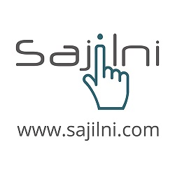

# Sajilni.com

 

Sajilni.com is an online event management and e-ticketing platform that  enables event organizers, promoters and venue owners to sell tickets in a click of a button.

Sajilni has expanded its offerings and capitalized on the latest trends in ticketing technologies to
serve the event organizers needs by offering its software as a white label ticketing solution.

Sajilni solution can be customized at levels based on your event needs

1. White labelling  Sajilni application
2. Theming Sajilni for one event 
3. Theming Sajilni for multiple events 

### **1) White Labeling Sajilni Application**

Sajilni white label solution can be used by organizers to integrate into their website , sell tickets and process transactions with total control.

Organizers will have their  subdomain ([clientname].sajilni.com) and can enjoy the full features of Sajilni.

For more info about our white label solution please contact us  [here](https://www.sajilni.com/info/contact-us.html). 

##### 1. Header & Footer Styling

Fully customizable **Header** and **Footer** to suit the look and feel of your brand.

##### 1.1 Header Styling

**Requirements** **for customizing the header** 

1. Logo size **182 X 97** (Recommended) with transparent background.

 [Example Sajilni Logo](https://www.sajilni.com./assets/resources/img/logo.png) 

1. Social media links ( Facebook, Twitter, Instagram)
2. Your brand font.
3. Background color.

##### 1.2 Header Menu 

Customizing the header menu includes, and not limited to the following :

1. Show/Hide **Filter By Event Categories** menu
2. **Sell with us**
3. Show/Hide **Login**, and **Signup page**

##### 1.3 Footer Menu 

Customizing the footer menu includes, and not limited to the following : 

1. Your Company Logo
2. Your Company Name
3. Help Button (Integrating with your help desk platform if available ) 
4. Colors used on the footer

##### 1.4 Footer Menu Static Pages

Customizing the content of the static menu pages 

1. About Us
2. Contact Us
3. FAQs.
4. Terms of service
5. Privacy Policy
6. Sell with us
7. Pricing      

##### 2. Signup Page Styling

Customize the sign-up page to match the color and theme of your brand

1. Header / title of the sign up window
2. Sign up button color
3. Add your own terms of service and privacy policy
4. Customize the pop-messages after the user submits his request
5. Fully customizable email communication for sign up confirmations  

##### 3. Event page Styling

Brand your ticketing page with your event artwork , brand colors, logo, videos and pictures etc..

**That includes**:

1. Customizing Header & Footer 

2. Changing the colors of Buttons used Example ( Buy Tickets Button)

3. Design for the page including:

   1. Images.

   2. Event details

   3. Location of the event .

   4. Where and how to view gallery.

   5. Font to use in this page ( Ideally this affect only the [sticky part](/home?id=_2-2-information-bar-sticky), because the details of the event can be formatted with special editor in add event).

      ##### **How it works :**

   

| # Part                     | Colour | Font | Image | Hide | Extra                | Requirements                                                 |
| -------------------------- | ------ | ---- | ----- | ---- | -------------------- | ------------------------------------------------------------ |
| 1.Header                   | Y      | Y    | N     | Y    |                      | Hex Colour, and fonts and size in following priority , eot, woff, ttf, all for best results across all devices. |
| 2. Header Logo             | N      | N    | Y     | Y    | **Logo size 182X97** | Transparent back ground Logo image                           |
| 3. Sticky Part             | Y      | Y    | N     | Y    |                      | Colour in Hex, and fonts and size in following priority , eot, woff, ttf, all for best results across all devices. |
| 4. Icons                   | Y      | N    | N     | N    |                      | Hex Colour                                                   |
| 5. Sticky background       | Y      | N    | N     | N    |                      | Hex Colour                                                   |
| 6. Buy Button              | Y      | Y    | N     | N    |                      | Hex Colour, and fonts and size in following priority , eot, woff, ttf, all for best results across all devices. |
| 7.Buy Button price         | Y      | Y    | N     | N    |                      | (**Hint**) you can ask to hide the price, or change the text, in Sajilni its **Buy Ticket** by default, and fonts and size in following priority , eot, woff, ttf, all for best results across all devices. |
| 8. Count Down Part Colour  | Y      | Y    | N     | N    |                      | Hex Colour, and fonts and size in following priority , eot, woff, ttf, all for best results across all devices. |
| 9. Count Down Part Hide    | N      | N    | N     | Y    |                      | Hide or Show                                                 |
| 10. Special Instructions   | N      | N    | N     | Y    |                      | Hide or Show                                                 |
| 11. Artists                | N      | N    | N     | Y    |                      | Hide or Show                                                 |
| 12. Event Description Part | Y      | Y    | Y     | Y    |                      | [You Can Use This](http://res.cloudinary.com/shareefhiasat/image/upload/v1544360906/sajilni-docs-resources/ckeditor-usage.png) to do almost anything |
| 13. Gallery Photos         | N      | N    | N     | Y    |                      | Hide or Show                                                 |
| 14. Videos                 | N      | N    | N     | Y    |                      | Hide or Show                                                 |
| 16. Tags                   | N      | N    | N     | Y    |                      | Hide or Show                                                 |
| 17. Contact Organizer      | Y      | N    | N     | Y    |                      | Hex Colour, Hide or Show                                     |
| 18. Map                    | N      | N    | N     | Y    |                      | Hide or Show                                                 |
| 19. Footer Logo            | N      | N    | Y     | Y    | **Logo size 182X97** | Transparent back ground Logo image                           |
| cont... Footer             | Y      | Y    | N     | Y    |                      | Hex Colour, and fonts, and size in following priority , eot, woff, ttf, all for best results across all devices. |
| 20.  Footer Buttons        | Y      | Y    | N     | Y    |                      | Hex Colour, for both help, and top icon, ,= and fonts and size in following priority , eot, woff, ttf, all for best results across all devices. |

##### 4. Styling the Organizer Page

This page displays all the events that are published by the organizer.

**That includes:**

1. Customizing Header & Footer 
2. Changing the button colors Example ( Buy Tickets Button)
3. Design for the page :
   1. Featured Image (generic artwork used).
   2. Social Media Links ( Facebook, Twitter, Instagram) etc...
   3. Website URL.
   4. Font to use in this page.
   5. If any special UI/UX design is provided our technical team can work on it

##### 5. Styling the Buy Ticket process

Add your own theme, logo and colors on the buy tickets process as shown below; 

| # Part                           | Colour | Font | Image | Hide | Extra                                                        | Requirements                                                 |
| -------------------------------- | ------ | ---- | ----- | ---- | ------------------------------------------------------------ | ------------------------------------------------------------ |
| 1.Header                         | Y      | N    | N     | N    |                                                              | Hex Colour                                                   |
| 2. Logo Top-Left                 | N      | N    | Y     | Y    | **Logo size 182X97**                                         | Transparent back ground Logo image                           |
| 3. Logo Centre                   | N      | N    | Y     | Y    | **Logo size 1000X100**                                       | Transparent back ground Logo image, if used then no top-left or top-right should be added it will cover whole header |
| 4. Logo Top-right                | N      | N    | Y     | Y    | **Logo size 182X97**                                         | Transparent back ground Logo image                           |
| 5. Event title/details           | Y      | N    | N     | Y    |                                                              | Hex Colour, and other colour for **icons**                   |
| 6. Event Image                   | N      | N    | Y     | Y    |                                                              | Add Image for event                                          |
| 7.Even rows                      | Y      | N    | N     | N    |                                                              | Hex Colour                                                   |
| 8. Odd rows                      | Y      | N    | N     | N    |                                                              | Hex Colour                                                   |
| 9. Text Colour                   | Y      | N    | N     | N    | [You Can Use This](http://res.cloudinary.com/shareefhiasat/image/upload/v1544360906/sajilni-docs-resources/ckeditor-usage.png) | Hex Colour                                                   |
| 10. Spinner                      | Y      | N    | N     | N    | 3 Colours                                                    | **3 Hex Colour**, for + ,- and the middle quantity box       |
| 11. Footer                       | Y      | N    | N     | N    |                                                              | Hex Colour                                                   |
| 12. Next Button, at bottom right | Y      | N    | N     | N    | Any Custom Text                                              | Hex Colour                                                   |
| 13. Help                         | N      | N    | N     | Y    |                                                              | Hide or Show                                                 |
| 14. Close top-right              | N      | N    | N     | N    |                                                              | N/A                                                          |
| 15. Buying Body Colour           | Y      | N    | N     | N    |                                                              | Hex Colour                                                   |
| 16. Form Background Colour       | Y      | N    | N     | N    |                                                              | Hex Colour                                                   |
| 17.1 Print Buttons Text          | N      | N    | N     | N    | Text Only                                                    | Text for print button                                        |
| 17. 2 Print Button Text Colour   | Y      | N    | N     | N    | Text Colour                                                  | Hex Colour                                                   |
| 17.3 Print Button Colour         | Y      | N    | N     | N    | Button Colour                                                | Hex Colour                                                   |
| 18.Other events button           | N      | N    | N     | Y    |                                                              | Hide or Show                                                 |
| 19.1 Close Button Colour         | Y      | N    | N     | N    |                                                              | Hex Colour                                                   |
| 19.2 Close Buttons Text          | N      | N    | N     | N    | Text Only                                                    | Text for Close Button                                        |
| 19.3 . Close Button Text Colour  | Y      | N    | N     | N    |                                                              | Hex Colour                                                   |
| 20.1 Back Button Colour          | Y      | N    | N     | N    |                                                              | Hex Colour                                                   |
| 20.2 Back Buttons Text           | N      | N    | N     | N    | Text Only                                                    |                                                              |
| 20.3 Back Button Text Colour     | Y      | N    | N     | N    |                                                              | Hex Colour                                                   |

##### 6. Custom Payment Integration

Sajilni offers different online payment methods to the organizer such as  Credit Card (Visa,Mastercard, Amex) and Paypal.  We also offer the option to integrate with the organizers' payment gateway.

Our technical team will support throughout the process of integration.  For more info [please contact us.]()

##### 7. Email Communication Templates

Organizers can communicate with their attendees with our automated email response, the content, design is customizable to reflect the look & feel of the brand .

##### **7.1 Signup Email**

##### To customize the signup email:

. Design of the email (Logo, images).

.  Header & Footer design.

· Content ( Email Body)

· Email Subject

·  Email Sender (From).

· Email address used (example) [info@sajilni.com](mailto:info@sajilni.com) .

##### 7.2 Order Confirmation Email

Order Confirmation Emails are sent once the buyer places an order for an event.

##### Requirements to customize the Order Confirmation Emails:

. Design of the email (Logo, images).

.  Header & Footer.

· Content 

· Email Subject

·  Email Sender ( From).

· Email address used (example) [info@sajilni.com](mailto:info@sajilni.com) .

##### 7.3 Payment Confirmation Email

 The payment confirmation email is automatically sent once a buyer pays for his ticket/registration. 

**Requirements:**

1. Design of your choice(Logo, any picture, buttons).
2. Header & Footer design
3. Content of the email ( Email body)
4. Header & Footer
5. Email Subject
6. Email Sender ( From)
7. Email address used (example) [info@sajilni.com](mailto:info@sajilni.com) .

##### **7.4 Ticket Confirmation Email** 

The ticket confirmation email is automatically sent once a user receives the e-ticket. 

**Requirements:**

1. Design of your choice(Logo, any picture, buttons).
2. Header & Footer design
3. Content of the email ( email body)
4. Header & Footer
5. Email Subject
6. Email Sender ( From)
7. Email address used (example) [info@sajilni.com](mailto:info@sajilni.com) .

   Note : Customizations is only available for white label solutions

##### 7.5 Invitation Emails (RSVP)

Invitation Emails are RSVP based emails where buyers have two options to respond to the invitation  either Confirm or Decline; incase the invitation is confirmed the buyer continues with the registration/ buying process incase the invitation is declined the organizer can track the response.

**Requirements:**

1. Design of your choice(Logo, any picture, buttons).
2. Header & Footer design
3. Content of the email ( email body)
4. Header & Footer
5. Email Subject
6. Email Sender ( From)
7. Email address used (example) [info@sajilni.com](mailto:info@sajilni.com) .
8. Buttons Color for confirming the invitation.

##### 7.6 By Request Email

The By Request ticket type is used when the organizer requests pre-approval of attendees based on a certain criteria ( admin pre-approval)

 **3 Email Templates** are  used for the by request ticket type:

1. Confirmation email for the request submission
2. Acceptance email when organizer accepts the request after reviewing.
3. Rejection email when the organizer declines the request.

**Requirements:**

1. Design of your choice(Logo, any picture, buttons).
2. Header & Footer design
3. Content of the email ( email body)
4. Header & Footer
5. Email Subject
6. Email Sender ( From)
7. Email address used (example) [info@sajilni.com](mailto:info@sajilni.com) .

##### 7.8 User Creation Email

As an admin for the event page you can create users to sell, follow-up or just monitor ticket sales . You can manage users, create, edit or delete.

When you create users they will receive an email with their credentials to login.

**Requirements:**

1. Design of your choice(Logo, any picture, buttons).
2. Header & Footer design
3. Content of the email ( email body)
4. Header & Footer
5. Email Subject
6. Email Sender ( From)
7. Email address used (example) [info@sajilni.com]
8. Buttons Color 

##### 7.9 Newsletter

Keeping your clients up to date with new events , reminders about the event etc.. you can send newsletters and customize the content.

**White label requirements :**

1. Design of your choice(Logo, any picture, buttons).
2. Header & Footer design
3. Content of the email ( email body)
4. Header & Footer
5. Email Subject
6. Email Sender ( From)
7. Email address used (example) [info@sajilni.com].

##### 8. Default PDF Ticket Templates

Customize the ticket templates according to your event theme and branding (colors, fonts , images ,language, terms & conditions).

**Sample of a default e-ticket generated from Sajilni** 

| # Part              | Colour | Font | Image | Hide | Extra                                                        | Requirements                                                 |
| ------------------- | ------ | ---- | ----- | ---- | ------------------------------------------------------------ | ------------------------------------------------------------ |
| 1.Main Image        | N      | N    | Y     | Y    | Dimension Free, with respect to ratio.                       | Recommended, 678.5mm  X 257.08mm                             |
| 2. code 128 Barcode | N      | N    | N     | Y    | Auto generated                                               | Recommended, 175mm X 110mm                                   |
| 3. QR code          | N      | N    | N     | Y    | Auto generated                                               | Recommended, 85.282mm X 89.564mm                             |
| 4. Logo             | N      | N    | Y     | Y    |                                                              | Recommended, 59.565mm X 53.263mm                             |
| Size of ticket      | N      | N    | N     | N    |                                                              | 175.006mm X 110mm                                            |
| **Features**        | Y      | Y    | Y     | Y    | Easy drag drop, resize, with lots of properties, and there is off the shelf dynamic  variables | You can do changes to any content, colour, font style etc.. WYSIWYG |

 Any customized ticket is built using **Sajilni** ticket builder

**Requirements:**

1. Main Image on the ticket, if there is no custom ticket background defined for that event.
2. Size of ticket in millimetre, or predefined as A4, A5 etc...
3. Place of barcode(s) in millimetre.
4. Size of barcodes(s) in millimetre.
5. Content of the ticket like, Order Id, Ticket No, Buyer name, Event name, Ticket Type, Date, time etc...
6. Any Shape as Design, Colour, Font Size, UI.
7. Content

##### Sample of customized e-tickets

| # Part               | Colour | Font | Image | Hide | Extra                             | Requirements     |
| -------------------- | ------ | ---- | ----- | ---- | --------------------------------- | ---------------- |
| 1. Main image        | N      | N    | Y     | Y    | User upload or url                | 210mm X 297 mm   |
| 2. Barcodes          | N      | N    | N     | Y    | Auto generated                    | 385mm X 59.268mm |
| 3.Ticket information | Y      | Y    | N     | Y    | Auto generated                    | Fully Stylable   |
| 4. Ticket Type       | Y      | Y    | N     | Y    | Auto generated                    | Fully Stylable   |
| 5. Logo              | Y      | Y    | Y     | Y    | You can put any footer/logo etc.. | Fully Stylable   |

##### 9.1 Point of Sale Tickets

Sajilni platform allows you to create templates for point of sale tickets ( tickets sold at point of sale or on event day )

**Requirements:**

1. Main Image on the ticket, if there is no custom ticket background defined for that event.
2. Size of ticket in millimeter, or predefined as A4, A5 etc...
3. Place of barcode(s) in millimeter.
4. Size of barcodes(s) in millimetre.
5. Content of the ticket like, Order Id, Ticket No, Buyer name, Event name, Ticket Type, Date, time etc...
6. Any Shape as Design, Color, Font Size, UI.
7. Any Fixed Content.

##### **9.2 POS Custom Template**

| # Part                   | Colour | Font | Image | Hide | Extra                                                        | Requirements                                                 |
| ------------------------ | ------ | ---- | ----- | ---- | ------------------------------------------------------------ | ------------------------------------------------------------ |
| 1. code 128 Barcode      | N      | N    | N     | Y    | Auto generated                                               | 79.621 X 22.52                                               |
| 2.Ticket No              | Y      | Y    | N     | Y    |                                                              |                                                              |
| 3. and 4. Size of ticket | N      | N    | N     | Y    | Auto generated                                               | 40mm X 20mm                                                  |
| **Features**             | Y      | Y    | Y     | Y    | Easy drag drop, resize, with lots of properties, and there is off the shelf dynamic  variables | You can do changes to any content, color, font style etc.. WYSIWYG |

##### 10. Custom Home page

Display all of your events through your own homepage design and theme.

Homepage design includes the following customizations:

1. Desired layout & design
2. Search layout used to search for events 
3. Events Layout.
4. Google Analytics code.
5. Customer support help integration.
6. Header & Footer 

####  

| # Part                       | Colour | Font | Image | Hide | Extra                | Requirements                                                 |
| ---------------------------- | ------ | ---- | ----- | ---- | -------------------- | ------------------------------------------------------------ |
| 1.Header                     | Y      | Y    | N     | Y    |                      | Hex Colour                                                   |
| 2. Header Logo               | N      | N    | Y     | Y    | **Logo size 182X97** | Transparent back ground Logo image                           |
| 3. Featured Part Description | Y      | Y    | N     | Y    |                      | We Recommend To Hide It, colour in Hex, and fonts and size in following priority , eot, woff, ttf, all for best results across all devices. |
| 4. Buy Button                | Y      | Y    | N     | N    |                      | Hex Colour, (**Hint**) you can ask to hide the price, or change the text, in Sajilni its **Buy Ticket** by default |
| 5. Main search button        | Y      | Y    | N     | N    |                      |                                                              |
| 6. Main background           | Y      | N    | N     | N    |                      | Hex Colour                                                   |
| 7. Event Card Block          | Y      | Y    | N     | N    |                      | Hex Colour, and fonts, and size in following priority , eot, woff, ttf, all for best results across all devices. |
| 8. Event Card Block Icons    | Y      | N    | N     | N    |                      | Hex Colour                                                   |
| 9. Buy Button                | Y      | Y    | N     | N    |                      | Hex Colour, (**Hint**) you can ask to hide the price, or change the text, in Sajilni its **Buy Ticket** by default |
| 10. Load more Button         | Y      | Y    | N     | N    |                      | You can make it wider all through screen width               |
| 11. Subscribe                | Y      | Y    | N     | Y    |                      | Hex Colour, and fonts, and size in following priority , eot, woff, ttf, all for best results across all devices. |
| 12. Footer Logo              | N      | N    | Y     | Y    | **Logo size 182X97** | Transparent back ground Logo image                           |
| 13. Footer                   | Y      | Y    | N     | Y    |                      | Hex Colour, and fonts, and size in following priority , eot, woff, ttf, all for best results across all devices. |
| 14. Footer Buttons           | Y      | Y    | N     | Y    |                      | Hex Colour, for both **help, and top icon**                  |

##### 11. Scanning Application branding

**Sajilni** has powerful, yet customizable [Android scanning app](http://nimb.ws/a8YelD), the application includes many features such as 

\- Offline Scanning

\- Checking - in attendees  

\- Access Control 

\- Multiple date scanning

**Requirements:**

1. Your Logo 
2. Main Color for the APP.
3. Mint Color for the APP.

##### 12. Dialogue Messages

Any message can be customized in the platform 

Example, when a user requests a *by request* ticket , the pop-up message that appears :

*You have submitted your request successfully you shall receive and email confirmation of your request, and then when reviewed you shall receive acceptance or rejection.*

The above content can be customized

  

**General Note:**

***Please submit any design in AI format or send the Hex codes and font face in a regular file**
