# Sajilni

Create Events Fast And Easily Check Our Website  [Sajilni.com](https://www.sajilni.com) .

## Customizing Sajilni

With **Sajilni** you can **style**, **customize**, and Brand **white label** your events.

---
## Styling Sajilni Event Solution

Sajilni has power, in customizing not only behaviour but also, your event look and feel, of **Event page** and **Buy Process**

* [Check How New Event Page Without Styling/Images Looks Like](./assets/event-before-any-customization.webm)
* [Check How New Buy Ticket Without Styling/Images Looks Like](./assets/buyticket-normal.png)

### 1. Style Event Page

You can customize your **Event Page** for the following parts:

### 1.1 **Event Images**

You can set the styling/Customizations from Add/Edit Event page @TODO add link to add event, one thing to note here is the size of the image, although the site is responsive, but its the recommended size.

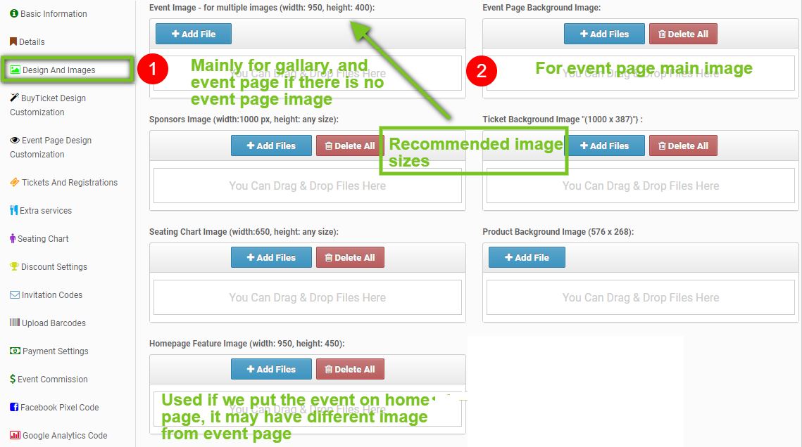

### **1.2 Style Event Page Design**

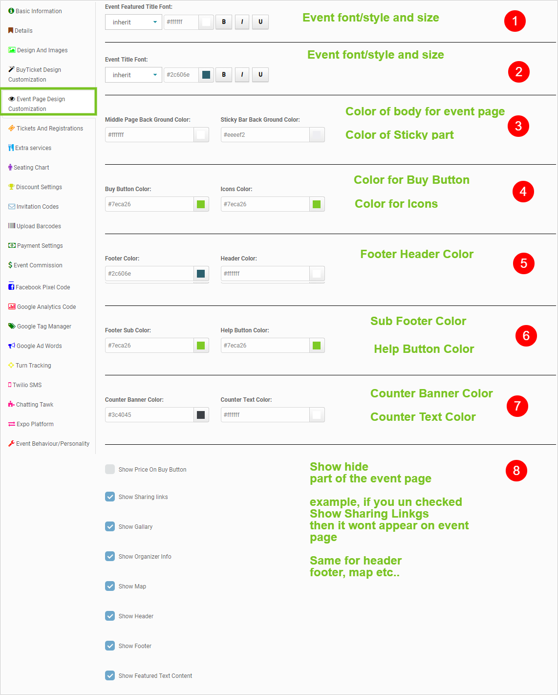

Lets do example and all will be clear, of course we can try every possibility :) .

###  1.3 Styling , Header, Footer, Colours, And Show or Hide, other parts

Below is examples when you hide the header, or and footer

#### 	1.3.1 Example 1

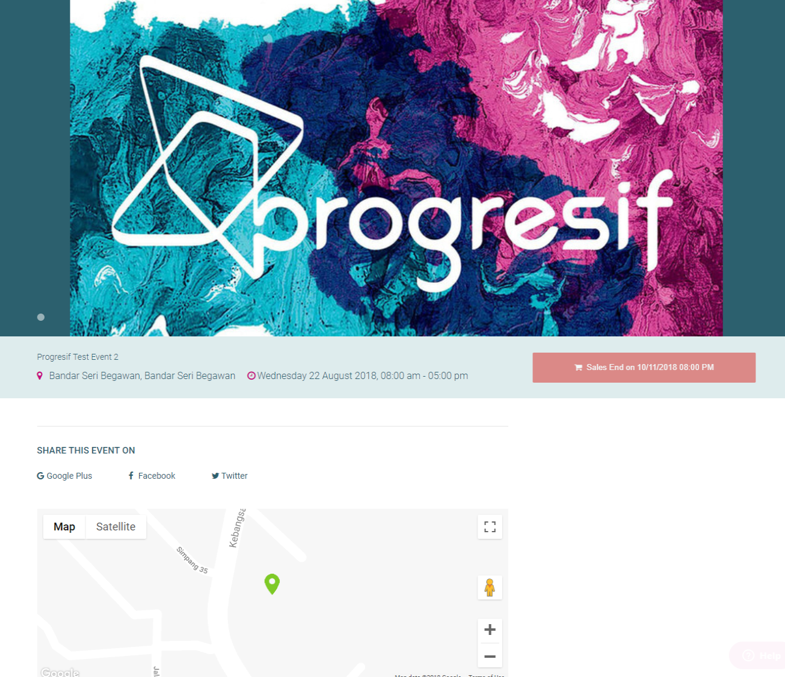

#### 	1.3.2 Example 2

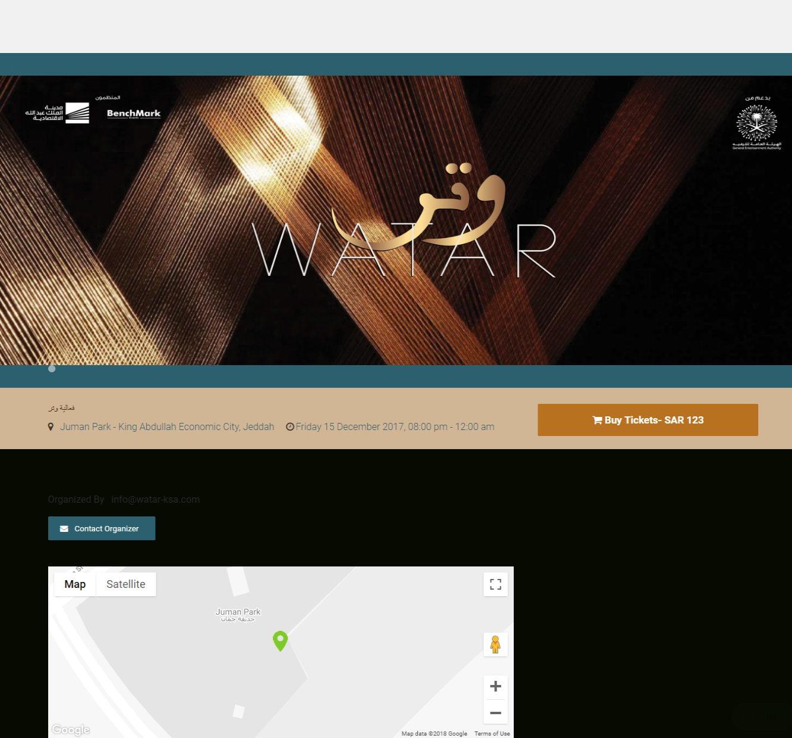

## 3. Style Buying Process

This part is so fun, because if you have your colours and logos, it will be like your site, but still it can be easily be ugly too, up to your styling.

### 3.1 Example 1

Here you can see:

* Top left Logo
* Berry colour for icons
* Seating Canvas Background color
* Footer Color
* Finally the next button Colour And Text

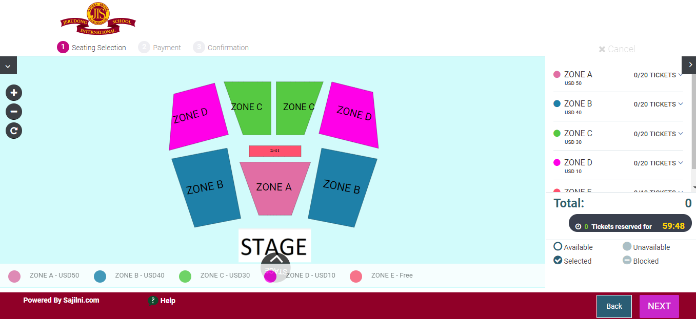

### 3.2 Example 2

What we have here, is Two main colours, and one mint colour

* Top left logo
* Berry Icons Colors
* Two Degrees of different Blues
* Note the Plus/Minus also changed
* Even, Odd Rows in ticket list is also changed

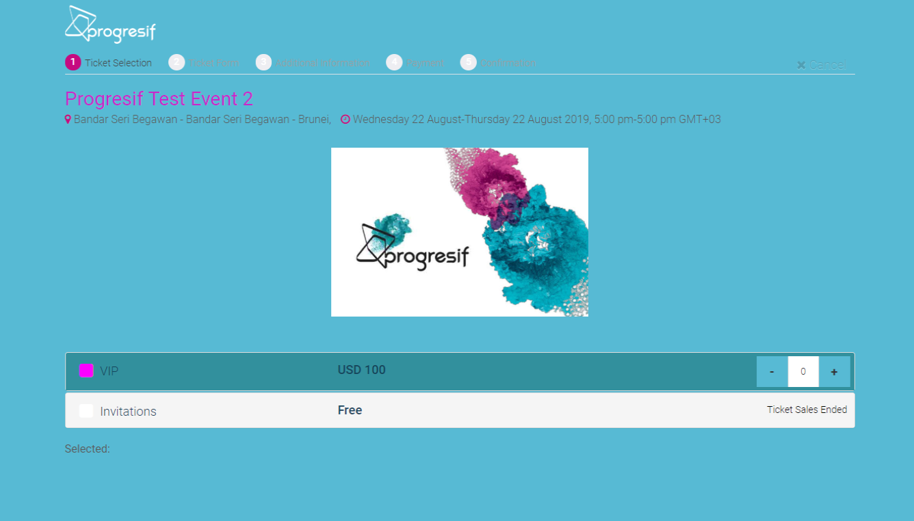

### 3.3 **Ticket Form side**

Here for the next step, ticket form, it inherits all the settings

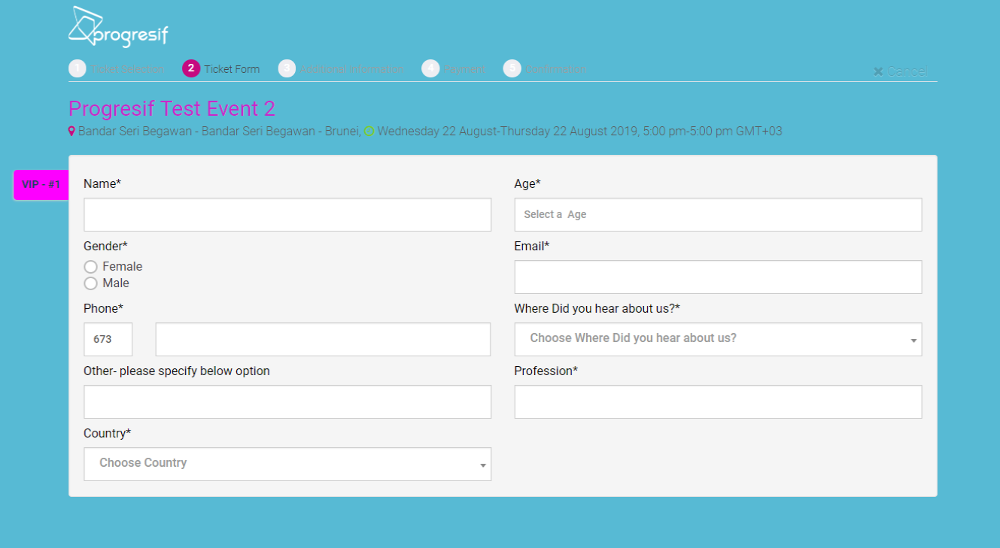

**Caution, Now check the below, if the colours is not smooth you might end up with ugly buy process.**

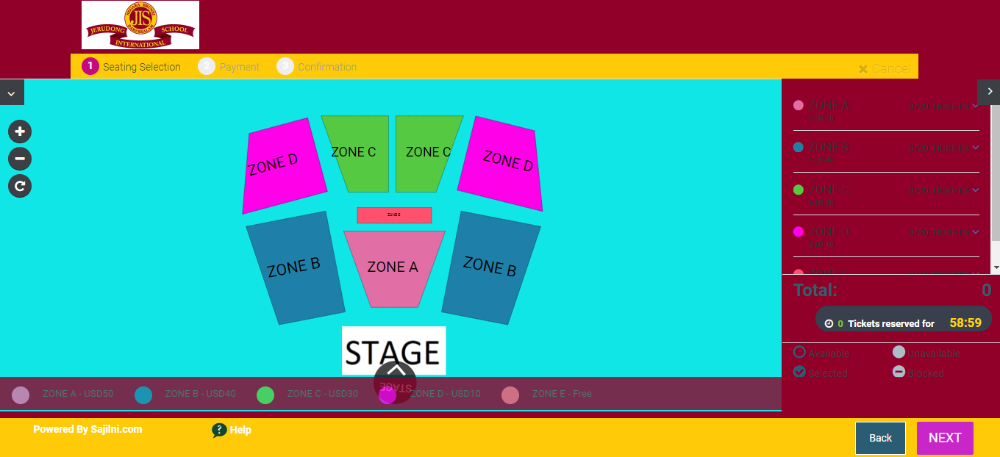

## 4. Email Template

To make things more great, there is no better way than nice email template, now you can customize your 

### 4.1 [Ticket Template](https://www.sajilni.com/ticket/build/build.html)

* Its customizable, Stylable, and can be on level of 
  * Ticket Type
  * Language
  * Bought via POS, or Online
  * Or on event level it self
  * Or if its printed as a badge, or ticket

**For more details check [Ticket Builder](/home?id=_2-9-2-ticket-builder)**

### 4.2 [Email Template](https://www.sajilni.com/mail/build/build.html)

* Ticket Email
* Payment ConfirmationEmails
  * Wire Transfer Email Template
  * Cash On Delivery Email Template
  * Paid Credit Card, etc.. Email Template
* Ticket By Request Email Template(confirm, accept, and rejection)
* Ticket Invitations Email Template
* Ticket Published Email Template

**For more details check [Mail Builder](/home?id=_2-7-3-mail-builder)**

* Customizable Registration Screen Template (**New Feature**)

##  5. **Styling all your Sajilni Events**

From your own logged in profile, you can set a default flavour for your colours, logos for your <u>event</u>s.

Same as [Styling your Single Sajilni Event](/home?id=style-event-page),  and check [Where to do it](http://nimb.ws/l8Z2Gb) , this is more abstract, generic so you don't repeat same work for every event you own [Style All Your Events At Once](http://nimb.ws/1gPubB).

## Theming/Branding Sajilni Application

Now you can do Branding/White labelling with **Sajilni**, (This is only available for white  label plan, contact info@sajilni.com), your design, your rules.

###  1. Styling Application header, Footer

The **Header**, And **Footer** is one of the most important parts, in the system, because it appears on every page from **Home Page**, **Event Page**, and **Static Pages** too.

#### 1.1 Header theming

In addition to styling feature [Styling header, footer](/home?id=styling-header-footer-colours-and-show-or-hide-other-parts), you can also, **White label Header** (This is only available for white  label plan, contact info@sajilni.com):

**Requirements**

1. Logo of size **182 X 97** (Recommended) with transparent background.

 [Example Sajilni Logo](https://www.sajilni.com./assets/resources/img/logo.png) 

2. Facebook, page of your preference.

3. Twitter, page of your preference.

4. Instagram, page of your preference.
5. Your preferred Font.
6. Main background colour, in case of **Sajilni** its white [white background header](www.sajilni.com)

#### 1.2 Header menu items

As you know [this is the header that is on home page and all system main screen.](/home?id=_1-1-header)

1. Show/Hide **Filter By Categories** menu.
2. **Sell with us** will be **hidden in all cases** of white labelling.
3. Show/Hide **Login**, and **Signup**. 

#### 1.3 Footer theming

In addition to styling feature [Footer](/home?id=_1-2-footer) where you can change in event page as example [read more here](/home?id=_2-event-page-design), you can also, **White label Footer** (This is only available for white  label plan, contact info@sajilni.com):

**Requirements**

1. Footer Logo.
2. Your Company Name.
3. Help Agent you want to integrate(This shall affect most of your pages).
4. Colour of footer.

#### 1.4 Footer static pages

Labels for, footers contains the following pages:

1. About Us.
2. Contact Us.
3. FAQs.
4. Terms and services.
5. Privacy Policy.

And here is how **Sajilni** Footer looks like [read more about footer](/home?id=_2-event-page-design) and its styling .

##  2. Styling the Signup page

You can now ask for white labelling, Sign Up Too ([read more about sign up here](/home?id=_1-sign-up)):

**Requirements**

1. Title of sign up.

2. Main button colour.

3. Terms and privacy.

4. Message to view for user after he submits, his request for sign up.

5. Email content, for sign up confirmation 

   * Here is how **Sajilni** [Default Confirmation email looks like](http://nimb.ws/GscRgL)

   * Here is how **Sajilni** default sign up looks like

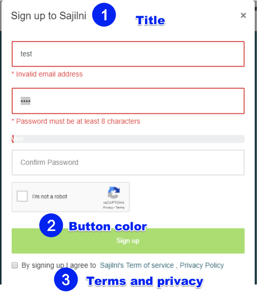

### 	2.1 Styling the [Event page](/home?id=_2-event-page)

And you can check here [Style Event Page](/home?id=_2-event-page-design) , how you may style it, but for further theming and white labelling, you can also, **White label Event Page** (This is only available for white  label plan, contact info@sajilni.com),  [here is how it looks like before any styling]([Check How New Event Page Without Styling/Images Looks Like](./assets/event-before-any-customization.webm)).

**Requirements**

1. Header Styles (common component [read more](/home?id=styling-header-footer-colours-and-show-or-hide-other-parts))
2. Footer Styles (common component [read more](/home?id=styling-header-footer-colours-and-show-or-hide-other-parts))
3. Main Buying button colour(Ideal same as the one used for [Sign Up](/home?id=_5-styling-the-signup-page) )
4. Size and Design for The Whole page including:
   1. Featured image part.
   2. Counter Count Down.
   3. Map to Inject.
   4. Where and how to view gallery, and even details.
   5. Font to use in this page ( Ideally this affect only the [sticky part](/home?id=_2-2-information-bar-sticky), because the details of the event can be formatted with special editor in add event).
5. Special Design/UI/UX ? , no problem just provide it to us.

### 	2.2 Styling the Organizer Page

[This organizer page](/home?id=_3-organizer-page) that shows all your organizers event, have similar theme, with some differences, to white label it consider the following requirements:

**Requirements:**

1. Header Styles (common component [read more](/home?id=styling-header-footer-colours-and-show-or-hide-other-parts))

2. Footer Styles (common component [read more](/home?id=styling-header-footer-colours-and-show-or-hide-other-parts))

3. Main Buying button colour(Ideal same as the one used for [Sign Up](/home?id=_5-styling-the-signup-page) )

4. Size and Design for The Whole page including:

   1. Featured image part (Organizer image, or may be venue).
   2. Facebook Page URL.
   3. Twitter Page URL.
   4. YouTube Channel URL.
   5. Website URL.
   6. Font to use in this page.

5. Special Design/UI/UX ? , no problem just provide it to us.

### 	2.3 Styling the [Buy Ticket process](/home?id=_4-buy-ticket-process)

As mentioned here [Styling Buy Ticket Process](/home?id=_2-style-buying-process), you can style the buy process to some great extend, to give your own unique flavour, experience to buying.

If you would like more, **White label** **Buy Ticket** (This is only available for white  label plan, contact info@sajilni.com),  [Check How New Buy Ticket Without Styling/Images Looks Like](./assets/buyticket-normal.png).

1. Logo, top left/ top right/ or even centred banner.

2. Colours for Even/Odd Rows in ticket list.

3. Size, colour and font for main texts in buying process.

4. Colour of Next Button.

5. Colour of Back Button.

6. Colour of Print Button.

7. Colour of Main Background.

8. Colour of Ticket Form Background.

9. Colour of Seating Plan Background.

10. Colour of Footer.

11. Colour of Header.

12. Colour of Spinner for increase/decrease Quantity of tickets.

13. Also hide some buttons, is optional like browse other events, and Try another payment.

###  	2.4 Custom [Payment](/home?id=_4-1-2-step-payment) Integration

At **Sajilni**, we have many payments methods, like PayPal, PayFort (@TODO add links to payement at sajilni), Still you can ask for your own payment gateway integration, for this regards, we shall need more technical details, about the API, Docs and we will implement it.

Another great thing is, you can provide us your bank account for these gateways to deposit directly into your accounts.

##  3. Email Communication

Communication is very important, Email is of course one of them, that's why we thought about it too.

If you would like more, **White label** **Emails** (This is only available for white  label plan, contact info@sajilni.com), [Check Contact Us](/home?id=contact-us).

### 	3.1 [Signup](/home?id=_1-sign-up) Email

First step is first, at **Sajilni** you can sign up, and of course emails is there to help, you will get a confirmation email in your inbox, to confirm your sign up.

You can ask us for theming your sign up email, Here is how **Sajilni** [Default Confirmation email looks like](http://nimb.ws/GscRgL)

If you would like more, **White label** **Emails** (This is only available for white  label plan, contact info@sajilni.com),  [Check Contact Us](/home?id=contact-us).

**Requirements:**

1. Design of your choice(Logo, any picture, buttons).

2. Main/Mint Colours

3. Header

4. Footer

5. Content.

6. Email Subject.

7. Email From.

8. Email Name.

9. Email Reply To.

### 	3.2 Order confirmation email (Pre-payment)

Now the fun part, Some one placed a post paid order, this has its own template as well, and you can check our default **Sajilni**, for Cash On Delivery, or Wire Transfer email template as example.

[Example of email Order Confirmation](http://nimb.ws/lJTxqc)

If you would like more, **White label** **Emails** (This is only available for white  label plan, contact info@sajilni.com),  [Check Contact Us](/home?id=contact-us).

**Requirements:**

1. Design of your choice(Logo, any picture, buttons).
2. Main/Mint Colours.
3. Header.
4. Footer.
5. Content.
6. Email Subject.
7. Email From.
8. Email Name.
9. Email Reply To.

### 	3.3 Payment Confirmation email

Yes, you got it right, some one paid to buy some cool event tickets, he shall receive another email as invoice so lets see **Sajilni** default Payment Confirmation Email [like this email e.g](http://nimb.ws/GPlwWD).

If you would like more, **White label** **Emails** (This is only available for white  label plan, contact info@sajilni.com), [Check Contact Us](/home?id=contact-us)

**Requirements:**

1. Design of your choice(Logo, any picture, buttons).

2. Main/Mint Colours.

3. Header.

4. Footer.

5. Content.

6. Email Subject.

7. Email From.

8. Email Name.

9. Email Reply To.

### 	3.4 Ticket Confirmation Email

When some one buys a ticket, he will get his tickets right ? well for this part we at **Sajilni**, have Email for ticket confirmation [Check example](http://nimb.ws/6D1la5), which will have attachments, for his tickets ( This is also customizable [Check this ticket e.g](http://nimb.ws/QcTvOx)).

If you would like more, **White label** **Emails** (This is only available for white  label plan, contact info@sajilni.com),  [Check Contact Us](/home?id=contact-us).

**Requirements:**

1. Design of your choice(Logo, any picture, buttons).

2. Main/Mint Colours.

3. Header.

4. Footer.

5. Content.

6. Email Subject.

7. Email From.

8. Email Name.

9. Email Reply To

### 	3.5 Invitation Email

This kind of email is related to tickets that you want to sell by invitations sent via email, client will find a button to click and continue his buying, this special email template is the first email we talk about that has buttons to interact besides [Sign Up so far](/home?id=_5-styling-the-signup-page).

If you would like more, **White label** **Emails** (This is only available for white  label plan, contact info@sajilni.com),  [Check Contact Us](/home?id=contact-us).

**Requirements:**

1. Design of your choice(Logo, any picture, buttons).

2. Main/Mint Colours

3. Header

4. Footer

5. Content.

6. Email Subject.

7. Email From.

8. Email Name.

9. Email Reply To

10. Buttons Colour for Yes, And No

### 	3.6 By Request Email

At some situations when you want to filter your clients, and carefully pick them for some approvals, this is what you need, we have **3 Email Templates** for request;

1. Confirmation email for your ticket request.

2. Acceptance email when organizer decide to accept you buying request (after he review).

3. Rejection email when organizer decides he wont proceed with your request any more.

Behind this logic, there is what user gets in his email for that here is a quick look at some of them that is used in **Sajilni** [, here is how request confirmation looks like](http://nimb.ws/nRJfuW) , here is how [acceptance email looks like](http://nimb.ws/NsCExJ).

If you would like more, **White label** **Emails** (This is only available for white  label plan, contact info@sajilni.com),  [Check Contact Us](/home?id=contact-us).

**Requirements:**

1. Design of your choice(Logo, any picture, buttons).

2. Main/Mint Colours.

3. Header.

4. Footer.

5. Content.

6. Email Subject.

7. Email From.

8. Email Name.

9. Email Reply To

### 	3.7 User Creation Email

Ok so you do wanna create your users under your control to sell, or follow-up may be just monitor etc..., you can do that at **Sajilni** , where you can manage users, create, edit or delete.

When you create user at **Sajilni** user shall get an email with his credentials, to continue login, that's it.

If you would like more, **White label** **Emails** (This is only available for white  label plan, contact info@sajilni.com),  [Check Contact Us](/home?id=contact-us).

**Requirements:**

1. Design of your choice(Logo, any picture, buttons).
2. Main/Mint Colours
3. Header
4. Footer
5. Content.
6. Email Subject.
7. Email From.
8. Email Name.
9. Email Reply To
10. Buttons color

### 	3.8 Newsletter

On demand to keep your clients up to date and new, with you we offer this as email to be sent on defined schedule, to your loyal clients.

If you would like more, **White label** **Emails** (This is only available for white  label plan, contact info@sajilni.com), [Check Contact Us](/home?id=contact-us).

**Requirements:**

1. Design of your choice(Logo, any picture, buttons).
2. Main/Mint Colours.
3. Header.
4. Footer.
5. Content.
6. Email Subject.
7. Email From.
8. Email Name.
9. Email Reply To.

##  4. Default PDF Ticket Templates

This concept is easy, yet very powerful,  it gives you the ability to distinguish the Ticket templates, by:

1. Which event you want them to be used for.
2. Which language you want them to be used for.
3. Which ticket types you want them to be used for.
4. Finally if its POS or E-Tickets.

We at **Sajilni** have One main template used by default, for any new event gets created have a look [here](http://nimb.ws/sPH2cU) its built with **Sajilni** [ticket builder, to build it](acceptance email looks like)

If you would like more, **White label** **Default Ticket Templates**  is here to help, (This is only available for white  label plan, contact info@sajilni.com),  [Check Contact Us](/home?id=contact-us).

**Requirements:**

1. Main Image on the ticket, if there is no custom ticket background defined for that event.
2. Size of ticket in millimetre, or predefined as A4, A5 etc...
3. Place of barcode(s) in millimetre.
4. Size of barcodes(s) in millimetre.
5. Content of the ticket like, Order Id, Ticket No, Buyer name, Event name, Ticket Type, Date, time etc...
6. Any Shape as Design, Colour, Font Size, UI.
7. Any Fixed Content

### 	4.1 POS Tickets

You have the ability to create, print as **POS** means you can have different templates for the tickets:

1. **Gets sold at the event (door,cash agents) [POS TICKETS]**
2. Get printed at the event as badges for example.

**Requirements:**

1. Main Image on the ticket, if there is no custom ticket background defined for that event.

2. Size of ticket in millimetre, or predefined as A4, A5 etc...

3. Place of barcode(s) in millimetre.

4. Size of barcodes(s) in millimetre.

5. Content of the ticket like, Order Id, Ticket No, Buyer name, Event name, Ticket Type, Date, time etc...

6. Any Shape as Design, Colour, Font Size, UI.

7. Any Fixed Content.

Have a look at some of the tickets we have :

* [Default **Sajilni** Ticket](http://nimb.ws/sPH2cU)

* Other Events Cool Tickets [, one of our previous events](http://nimb.ws/RjVwP5) , [another one too](http://nimb.ws/sp6u1X), [ Check POS print badges example ](http://nimb.ws/ebDJKw)

If you would like more, **White label POS Default tickets**  is here to help, (This is only available for white  label plan, contact info@sajilni.com),  [Check Contact Us](/home?id=contact-us).

### 	4.2 E-Tickets

You also can create, print as **E-Ticket** means you can have different templates for the tickets,**Get bought from online client. [E- TICKETS]**

**Requirements:**

1. Main Image on the ticket, if there is no custom ticket background defined for that event.

2. Size of ticket in millimetre, or predefined as **A4**, A5 etc..

3. Place of barcode(s) in **millimetre**.

4. Size of barcodes(s) in **millimetre**.

5. Content of the ticket like, Order Id, Ticket No, Buyer name, Event name, Ticket Type, Date, time etc..

6. Any Shape as Design, Colour, Font Size, UI.

7. Any Fixed Content.

Have a look at some of the tickets we have :

- [Default **Sajilni** Ticket](http://nimb.ws/sPH2cU)

- Other Events Cool Tickets [, one of our previous events](http://nimb.ws/RjVwP5) , [another one too](http://nimb.ws/sp6u1X), [ Check POS print badges example ](http://nimb.ws/ebDJKw)

If you would like more, **White label E-tickets**  is here to help, (This is only available for white  label plan, contact info@sajilni.com), [Check Contact Us](/home?id=contact-us).

## 5. Custom Home page

As we mentioned before [Home Page](/home?id=_1-home-page) has 2 parts to begin with:

* [Header](/home?id=_1-1-header)
* [Footer](/home?id=_1-2-footer)

You can also have your own home page Design, or Style, If you would like more, **White label Home Page**  is here to help, (This is only available for white  label plan, contact info@sajilni.com),  [Check Contact Us](/home?id=contact-us).

**Requirements:**

1. Design desired ( Your colours, font, designer thoughts).
2. Functionality desired (How Search Should Work Best For You).
3. Look and Feel (How Event Result List To Appear).
4. Google Analytics code.
5. You own help integration/ or we can provide ( **Sajilni** uses [Zendesk](http://nimb.ws/FBAoch)).

## 6. Scanning Application branding

**Sajilni** has powerful, yet customizable [Android scanning app](http://nimb.ws/a8YelD), it works offline, and do checking, and checkout too, lots of permissions, and monitoring as well.

If you would like more, **White label Scanning APP branding**  is here to help, (This is only available for white  label plan, contact info@sajilni.com),  [Check Contact Us](/home?id=contact-us).

**Requirements:**

1. Your Logo, when the app loads up it shows, at login page.
2. Main Colour for the APP.
3. Mint Colour for the APP.

## 7. Dialogue Messages

**Sajilni** provides a lot of messages to right the UX, for clients, its localized and every where, you may customize, change content for any message in the system, for example, when someone requests a tickets by request, it says: 

*You have submitted your request successfully you shall receive and email confirmation of your request, and then when reviewed you shall receive acceptance or rejection.*

You can ask to change any message on the system.

**Requirements:**

1. What language you want that message for
2. Where is that message
3. What is the content of that message
4. Any Additional logic you want this message to appear (New Message)

If you would like more, **White label Dialog Messages**  is here to help, (This is only available for white  label plan, contact info@sajilni.com),  [Check Contact Us](/home?id=contact-us).

------

# Styling Sajilni Event Solution

Sajilni has power, in customizing not only behaviour but also, your event look and feel, of **Event page** and **Buy Process**

* [Check How New Event Page Without Styling/Images Looks Like](./assets/event-before-any-customization.webm)
* [Check How New Buy Ticket Without Styling/Images Looks Like](./assets/buyticket-normal.png)

## Style Event Page

You can customize your **Event Page** for the following parts:

## 1. **Event Images**

You can set the styling/Customizations from Add/Edit Event page @TODO add link to add event, one thing to note here is the size of the image, although the site is responsive, but its the recommended size.

## **2. Event Page Design**

Lets do example and all will be clear, of course we can try every possibility :) .

###  Styling , Header, Footer, Colours, And Show or Hide, other parts

Below is examples when you hide the header, or and footer

#### 	Example 1

#### 	Example 2

## 2. Style Buying Process

This part is so fun, because if you have your colours and logos, it will be like your site, but still it can be easily be ugly too, up to your styling.

#### Example 1

Here you can see:

* Top left Logo
* Berry colour for icons
* Seating Canvas Background color
* Footer Color
* Finally the next button Colour And Text

#### Example 2

What we have here, is Two main colours, and one mint colour

* Top left logo
* Berry Icons Colors
* Two Degrees of different Blues
* Note the Plus/Minus also changed
* Even, Odd Rows in ticket list is also changed

**Ticket Form side**

Here for the next step, ticket form, it inherits all the settings

**Caution, Now check the below, if the colours is not smooth you might end up with ugly buy process.**

## 3. Email Template

To make things more great, there is no better way than nice email template, now you can customize your 

* [Ticket Template](https://www.sajilni.com/ticket/build/build.html)

  * Its customizable, Stylable, and can be on level of 
    * Ticket Type
    * Language
    * Bought via POS, or Online
    * Or on event level it self
    * Or if its printed as a badge, or ticket

  **For more details check [Ticket Builder](/home?id=_2-9-2-ticket-builder)**

* [Email Template](https://www.sajilni.com/mail/build/build.html)

  * Ticket Email
  * Payment Confirmation Emails
    * Wire Transfer Email Template
    * Cash On Delivery Email Template
    * Paid Credit Card, etc.. Email Template
  * Ticket By Request Email Template(confirm, accept, and rejection)
  * Ticket Invitations Email Template
  * Ticket Published Email Template

  **For more details check [Mail Builder](/home?id=_2-7-3-mail-builder)**

* Customizable Registration Screen Template (**New Feature**)

## How does it work

**Sajilni** is a ticketing System with complete cover of anyone needs, Just sign up and follow this guide.

### 1. Sign Up

To start using **Sajilni** as Organizer you have to [sign up first](https://www.sajilni.com) its pretty easy, I will show you how.
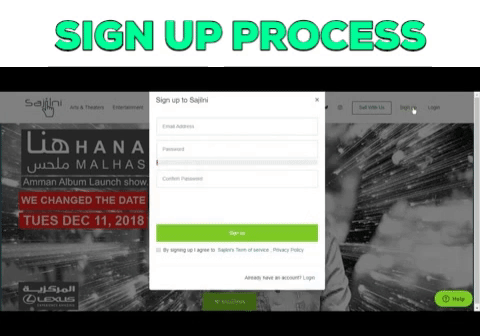

[Sign Up Full Vedio](./assets/sajilni-signup.webm)

1. Just go to, [https://www.sajilni.com](https://www.sajilni.com) and do sign up with your email address

2. You will get email for activation, Click on yes to activate and confirm your email

   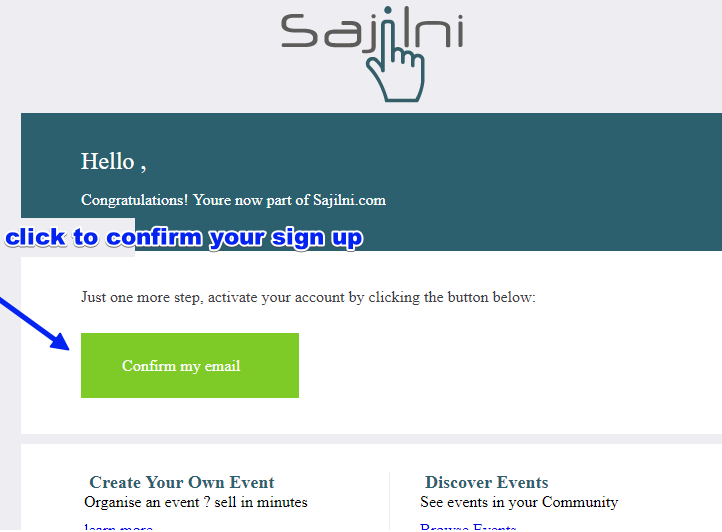

3. You will get another email with following test

   **Hello   sajilni-test-login@mailinator.com,**

   This is to inform you that your account has been successfully activated.

4. Done! Try login again

### 2. Login

Login process is clear and straightforward have a look

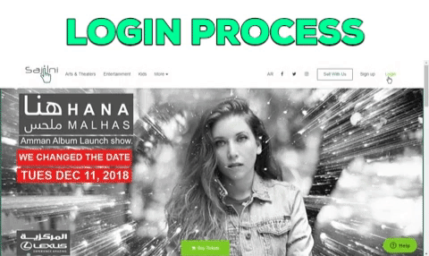

[Login Full Vedio](./assets/sajilni-login.webm)

## Sajilni Screens

This document is divided into **Following** main parts:

1. Buying A Ticket
2. Creating Events
   1. Single Event
   2. Recurrence Event
   3. Seated Event
   4. Styling Your Event
3. Sell With Us ( Static Pages )

### 1. Home Page

When you go to your browser and enter https://www.sajilni.com this will take you to Sajilni, it consists of :

#### 1.1 Header

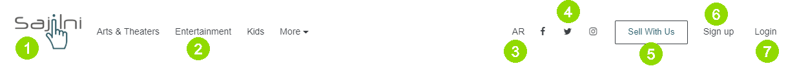

1. [Sajilni Logo](https://www.sajilni.com./assets/resources/img/logo.png)

2. Search By Event Category

   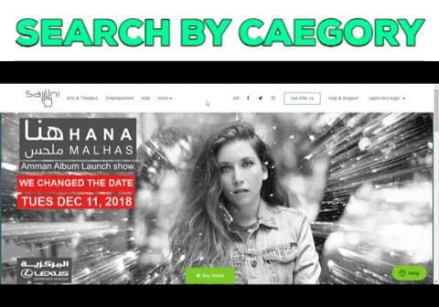

3. [Change Language](https://www.sajilni.com/?lang=ar)

4. Sajilni Social Medial [Facebook](https://web.facebook.com/sajilni),  [Twitter](https://twitter.com/sajilni) and, [Instagram](https://www.instagram.com/sajilni/)

5. [Static Pages About Sajilni](https://www.sajilni.com/info/sell-with-us.html)

6. [Sign Up](https://www.sajilni.com/user/signup.html)

7. [Login](https://www.sajilni.com/user/login.html)

#### 1.2 Footer

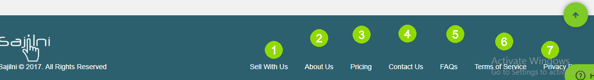

1. [Sell With Us Page](https://www.sajilni.com/info/sell-with-us.html)
2. [About Us Page](https://www.sajilni.com/info/about-us.html)
3. [Pricing Page](https://www.sajilni.com/info/pricing.html)
4. [Contact Us Page](https://www.sajilni.com/info/contact-us.html)
5. [FAQs Page](https://www.sajilni.com/info/faq.html)
6. [Terms Of Service](https://www.sajilni.com/info/terms-of-service.html)
7. [Privacy Terms](https://www.sajilni.com/info/privacy-policy.html)

#### 1.3 Menu

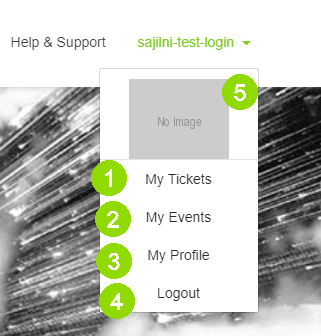

1. [My Tickets](https://www.sajilni.com/dashboard/index.html), Shows your orders/tickets/ and profile in other words, buyer dashboard
2. [My Events](https://www.sajilni.com/user/dashboard.html), Shows your organizer dashboard, this will show your events you have organizer, and setup
3. [My Profile](https://www.sajilni.com/user/profile.html), shows your profile from admin side
4. [Logout](https://www.sajilni.com/user/logout.html) from Sajilni

#### 1.4 Featured Part

When you open [Sajilni.com](https://www.sajilni.com) the biggest part of the screen on top, shows images in featured part, to be seen first.

#### 1.5 Search Criteria

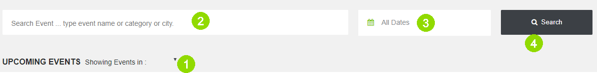

1. Choosing place to show events from

2. Search for event name,type,city or category( by choosing category)

   [Check Full Video How To Search By Category](./assets/sajilni-search-by-category.webm)

3. Search by date

   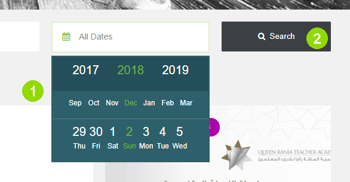

   1. Pick a date

   2. Click on Search

#### 1.6 Search Results

When you do a search, card with matched events will appear

1.  But Ticket button to buy a ticket

2.  Learn more link, will take you to event page

3. Venue as place/city

4. Date, time and period, and of course event name

#### 1.7 Help

Our System Sajilni is integrated with help platform, [Zendesk](https://www.zendesk.com/)

And when you click on it.... this dialog will appear

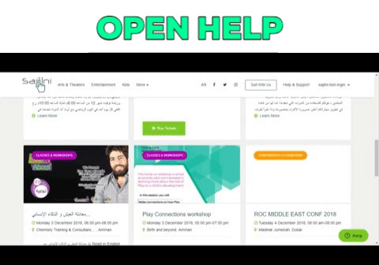

### 2. Event Page

Event Page is what we call, the home page for a specific event; it provide much detailed info

about the event with, Gallery, Video, Count Down, Special Conditions, Special Instructions and map.

[Example Of An Event Page](https://www.sajilni.com/event/horeca-jordan-2018)

#### 2.1 Featured Image

The main image for event page that covers most of the screen first look

#### 2.2 Information Bar (Sticky)

It shows Event Name, Place, Date And Time, as well as the Buy Button

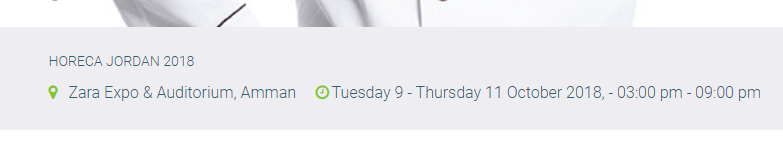

#### 2.3 Event Details

Its where we can put (What you see is what you get) from editor in add/edit event (later @TODO link)

#### 2.4 Social Media Part

From here you can share the event page on [Facebook](www.facebook.com), [Twitter](www.twitter.om), and [Google Plus](https://plus.google.com/discover)

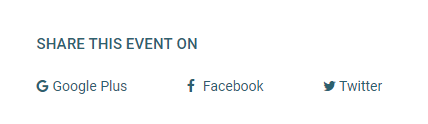

#### 2.5 Gallery

Images related to the event

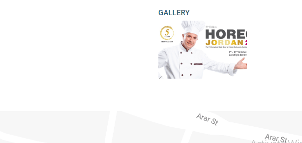

#### 2.6 Venue Google Map

Map at the bottom of the page shows the venue location

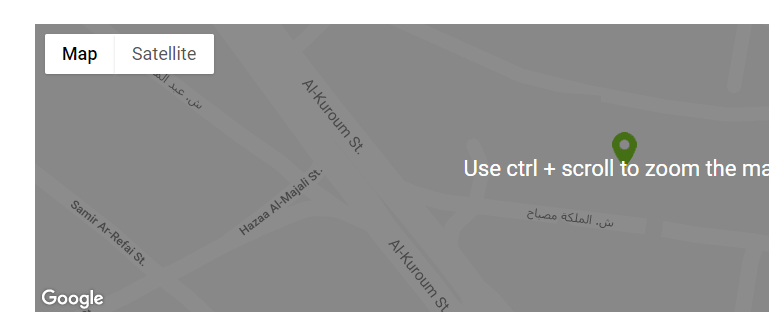

#### 2.7 Special Instructions, and Conditions

Guidance of rule for the event, and instructions, like parking, or meal, etc..

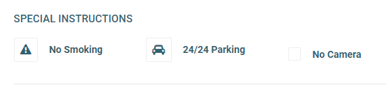

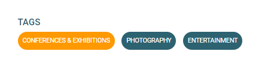

### 3. Organizer Page

#### 3.1 Featured Part

This part has, organizer image, and information about [youtube](www.youtube.com), [twitter](www.twitter.com), [facebook](www.facebook.com) 

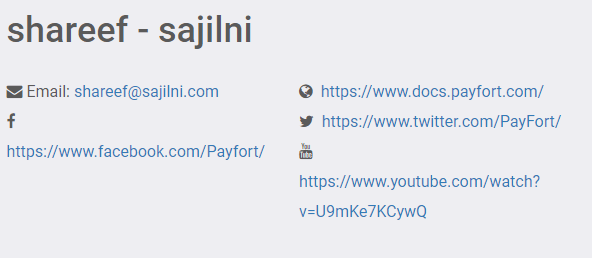

#### 3.2 List of organizer event

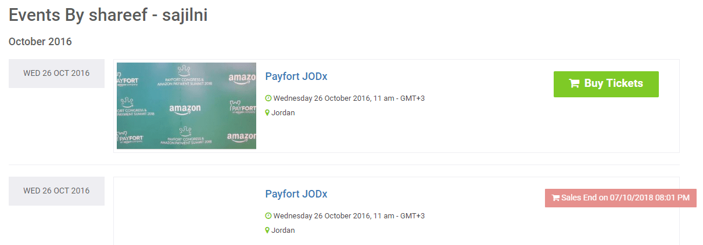

### 4. Buy Ticket Process

Whenever you see the green (**Buy Tickets button**) you can click to start buying, for that event.

#### 4.1 Buying Steps

##### 4.1.1 Step  - Ticket List

* Step 1: After you click on **Buy Tickets** Ideally you will see the **Ticket List**

  Here is basic event you can try buy from [Buying Process **Step1**](https://www.sajilni.com/cart-new/checkout/1755) ; The condition to see

  the ticket list is, and you can choose the quantity of which ticket you want:

  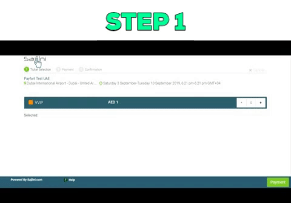

  **Ticket List Parts:**

  * Ticket names
  * Ticket color
  * Ticket Price
  * Ticket Details
  * Ticket Count
  * **Of course** there is many rules that determine *what and when* to show these tickets, and to who.

  1.  ( @TODO Add Link To Check Event Settings and Privacy)
  2.  ( @TODO Add Link To Check Ticket Settings and Privacy)

##### 4.1.2 Step - Ticket Forms (Configurable)

* When you choose your ticket types you want, and their corresponding quantity, you click next

  on Forms buttons, that in case you have a ticket with a form of course.

* If no forms exists, then you shall see either **Payment** button or **Extra(Other) services** button.@TODO (Add Link To form edit in event) and (Extra service part)

* How a form may look like, *Check the explanation in the photo below*:

  [Fill Ticket Form Full Vedio](./assets/buyticket-form-walktrhough.webm)

  

##### 4.1.2 Step - Optional Service (Optional)

* In some cases, Sajilni gives you ability to ask custom if he wants to have for free, or buy some kind of service, like Hotel Room, Or Valet Parking , Even a visa letter, if needed. (@TODO link to extra service in add event)

* Extra service or optional service, can have its own Form as well (@TODO link to forms of tickets internal) 

* And user can either choose to skip by clicking on *No,Thanks* or continue to payment after entering the quantity he wants for *Extra Service*

  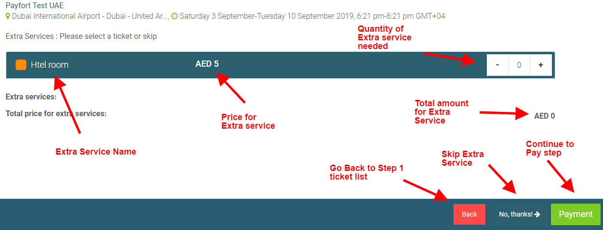

##### 4.1.2 Step Payment 

From this screen you can choose your preferred payment types(method), to reserve your ticket(s) or seat(s) and place an order, you have limited time to complete the order normally 1 hours, then the ticket will be not available for you and you have to go through buying once again.

The payment form, has many fields, one important one is the **Email** which you will be receiving the tickets on, and the payment confirmation as well, don't worry if you did not get it for any reason, like typo in email, you can always contact our operation team to resolve your issues, info@sajilni.com

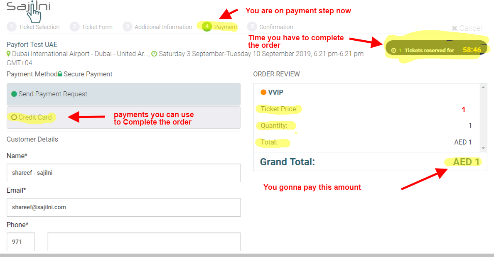

We have the following payment methods:

* PayPal

* Credit Card via Payfort

* Cash

* Free

* Pay At Location

* Pay At The Door

* Send Payment Request

* Wire Transfer

  (@TODO add link to details of the payments and how to configure)

# Sajilni Dashboard

## 1. Main View Of Dashboard

Here you can see the left black pane, which has many menus to choose from.

At the top right you can see your avatar, if you click on it you can then:

* Logout
* See your profile
* See your buyer Dashboard
* See your Events

## 2. Menu

### 2.1 Dashboard

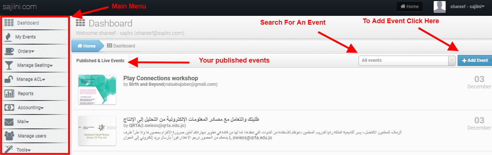

### 2.2 My Events

Search for your events by its status, 

* Published
*  Pending
* Draft
* Deleted
* Up Coming
* Season
* DTCM events.

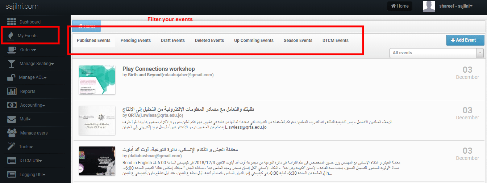

### 2.3 Orders

You can view the orders you have on a specific event, and ability to filter,export, and do other operations.

#### 2.3.1 Orders

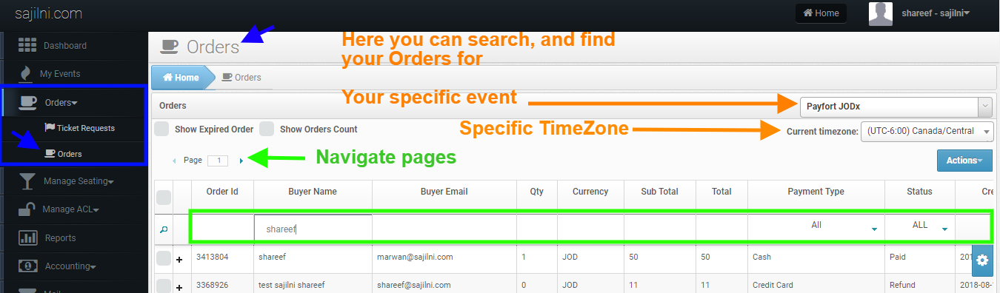

Orders page, has many operations embedded for user convenience:

##### 	2.3.1.1 Order operation overview

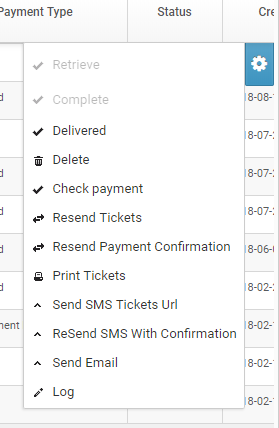

##### 2.3.1.2 Retrieve

If you accidently deleted an order you can retrieve it.

##### 2.3.1.3 Complete

You can complete order manually for cases, such as **Cash On Deliver** when you deliver the ticket and client pays the price of ticket and deliver, then Cash On Delivery Agent will make the order complete, normally when you buy as Cash, Or PayPal, Credit Card, it will be completed automatically if its success buy, if not it will stay as un paid for 1 hour then release the tickets to be sold to other client, the same concept applies to wire transfer too.

You have the option along with the complete operation, to send confirmation of the payment, and another email for the tickets, along with optional print the tickets with chosen template, 3 in 1.

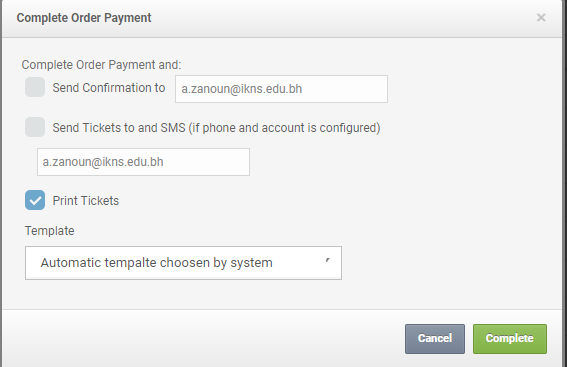

##### 2.3.1.4 Delivered

Mark the order as delivered, either via email which the system will mark, or buy choosing this operation in case like Cash On Delivery.

##### 2.3.1.5 Delete

Delete and order will make its status as Deleted, and the quantity will be released and become sellable to other buyers.

##### 2.3.1.6 Check Payment

Mark from accountant, its flag so accountant can audit the orders, and he can add some notes on the orders such as **Log**.

##### 2.3.1.7 Resend Tickets

Resending tickets, is normally used to send the email which contains the tickets you bought, you can change the email address to send it to other addresses, or same buyer address, in case he did not receive it or deleted by mistake.

##### 2.3.1.8 Resend Payment Confirmation

Resending the Payment Confirmation Email for buyer, upon request or for testing etc..

##### 2.3.1.9 Print Tickets

Print the order tickets, used buy cash agent, if necessary, or testing by operation team, also by organizer to print tickets for some order.

It has many options, 

* Choosing template to print upon

* Check progress of printing, e.g if you were printing 200 tickets

* Check Box for auto close template selector and open printed tickets upon completion of generating the tickets.

  [Vedio How To Use](./assets/printing-tickets.mp4)

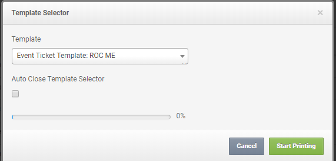

##### 2.3.1.10 Send SMS Ticket Url

If you have your SMS configured, you can send buyer SMS with URL to download his ticket on his mobile.

##### 2.3.1.11 Resend SMS With Confirmation

If you have you SMS configured, you can send buyer SMS with Order/Payment Confirmation and number.

##### 2.3.1.12 Send Email

If you want you can send custom email for Order buyer.

##### 2.3.1.13 Log

If you want you can log a message into an Order to mark it with some information, for reference.

[Full Vedio Explains Log](./assets/log-message-to-order.mp4)

#### 2.3.2 Ticket Request

One of the tickets privacies, is ticket by request, where the client sees only the step ticket list, and clicks on request now, for this type of privacies you wont see Quantity spinner, but it will take you to form where you can fill custom request, to ask for permission to buy some tickets, then when organizer reviews the request form info, he shall accept or reject the request, and so the client will get either acceptance or rejection email.

@TODO add email of request acceptance,rejection and confirmation samples

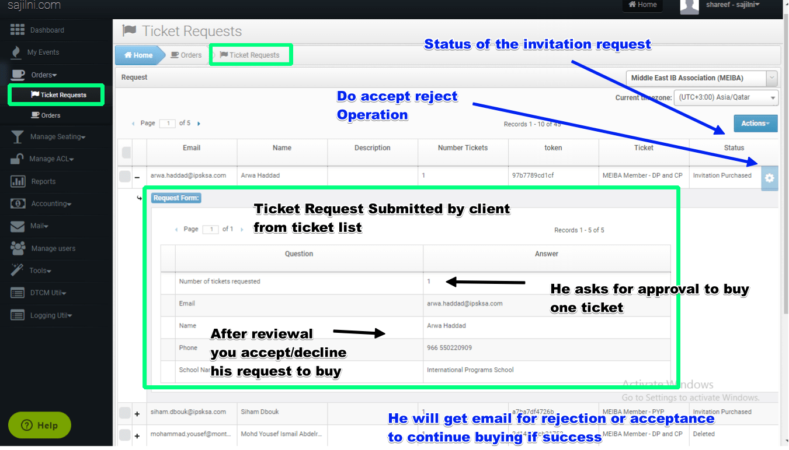

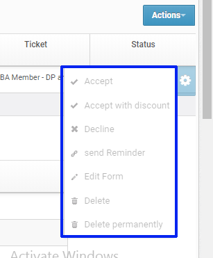

### 2.4 Manage Seating

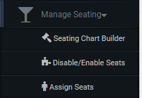

Manage all your seating charted event, the way you like it

#### 2.4.1 Seating Chart Builder

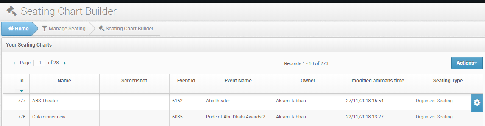

Seating Chart Builder is tool to build your canvas,  with seats, for your 

* Theatre

* Tables

* Stadium

  Style it, Name it, Edit it , Style it,  just name what ever you wanna do

  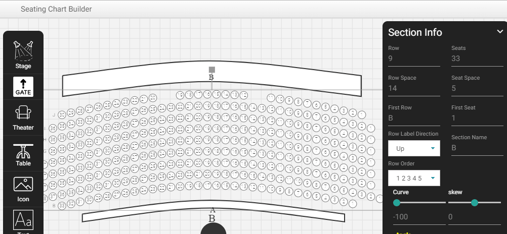

#### 2.4.2 Disable/Enable Seats

Click, Un Click to block some seats or sections, for really important guests.

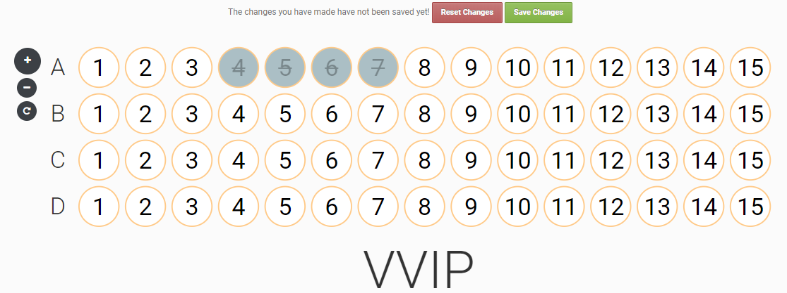

#### 2.4.3 Assign Seats

Assign seats, now you can change someone seat to any other seat as relocation, or promote your guest seat, or may be you changed your seating a little and want to move people to other table.

### 2.5 Manage ACL

You Access Location is important, yes its for scanning feature, freely customize you rules for scanning, as it goes for your needs.

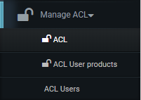

#### 2.5.1 ACL

Here you define rules, and how it relates to ticket types

* Rooms

* Entrances

* Rules for door agents

  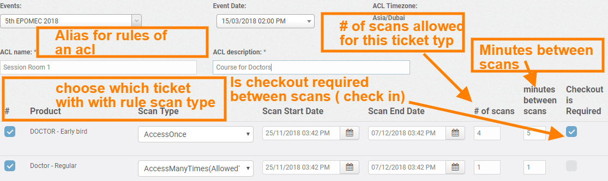

  Here you can define, which tickets, has what scan type, scan start Date, and end Date, as well as;

  * Product/ ticket type you want to be in **ACL**
  * Scan Type
    * Only Once
    * Multiple times
    * Multiple time with delay
    * Multiple times with delay and from start/end date time
  * Number of scans allowed
  * span/grace period between scans
  * Checkout is required, after each check in

#### 2.5.2 ACL User Products

Define each cash agent, what tickets he can sell

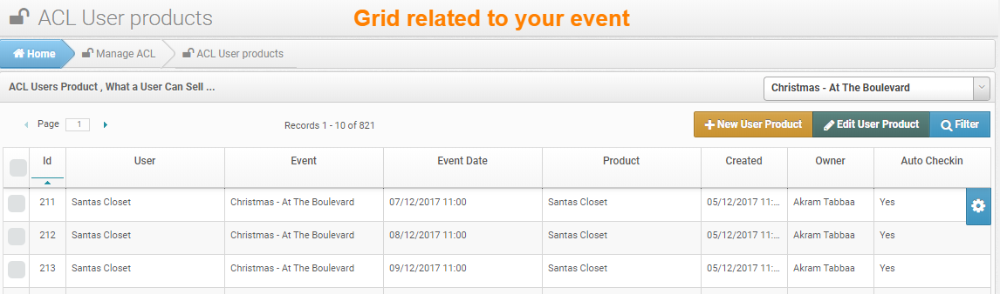

To add a user product let see from inside, there is a lot of things:

* choose a user
* choose tickets he can sell/see
* define behaviour of the selling experience
  * Enable auto check in each ticket he sells ( great for monitor main entrance)
  * Enable restart buying process after completion
  * Disable skip button on ticket form step (forces user to fill the form always)
  * Enable auto print the ticket after completion
  * Enable taking selfie image for the ticket printed (requires form with image selfie)
  * Enable On Site Search/Print Registration page

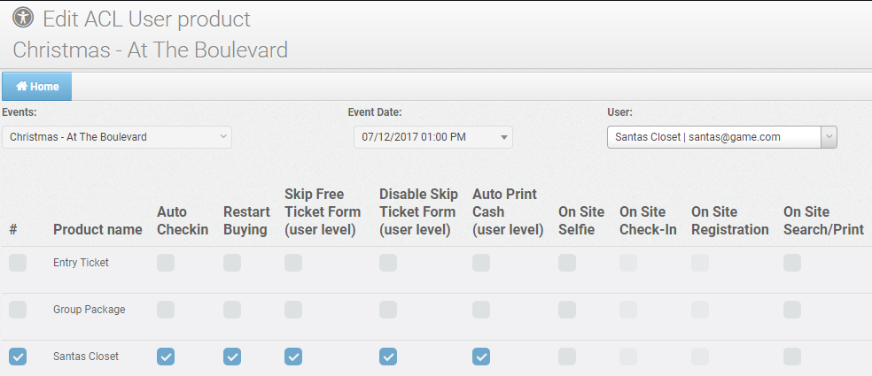

#### 2.5.3 ACL Users

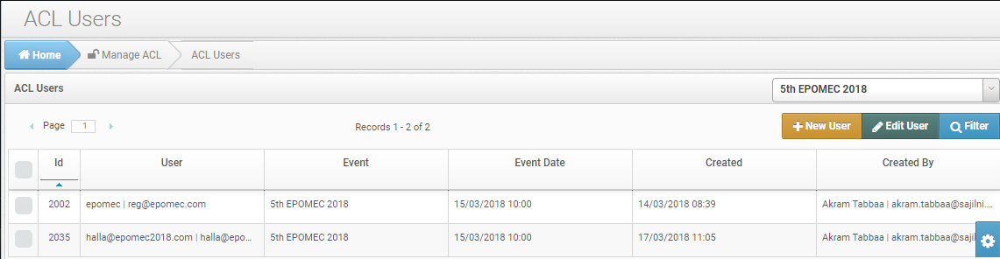

This screen job is to link users to their corresponding **ACL**defined here @TODO add link to acl ; interesting thing in this add **ACL**user screen is, you can define working hours for an agent e.g agent can scan for 4 hours only, this is another level of rules too.

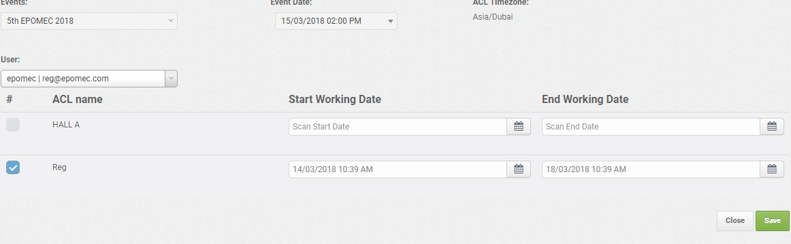

### 2.6 Reports

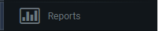

In **Reports** page you can 	analyse you event from different views

* Attendees ( View rows tickets, Group By Day, Ticket Type and Ticket Form or none)

* Orders (View rows as orders, with extra columns than @TODO(link to Orders) page)

* Extra Fees

* In completed Orders (View rows as Orders that is in state not completed)

* Tickets With discounts (View rows as tickets, not Orders)

* Pending Attendees (View rows as tickets like Cash On Delivery)

* Ticket Sales (View Orders from finance perspective)

* Payfort Report (View Orders bought via credit card payfort)

* Payfort Card Submit

* Access Control (View Event Tickets Scans)

* Sales By Payment Type (View how much you sold for each payment type)

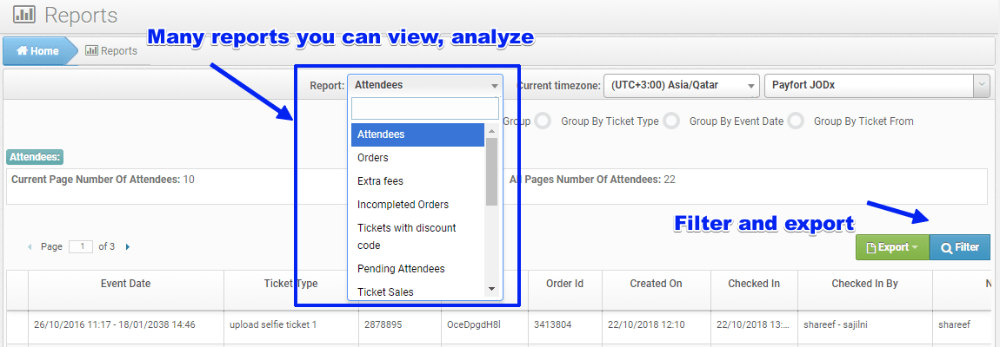

### 2.7 Mail

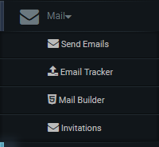

Manage your campaigns, and send email to promote your event, via invitations, or marketing.

#### 2.7.1 Send Emails

Send, emails with customized content, just write what you want

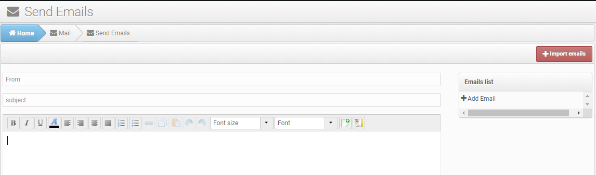

#### 2.7.2 Email Tracker

Follow-up your sent emails via our Email API

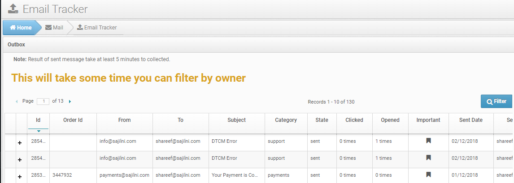

#### 2.7.3 Mail Builder

Customize your email mail templates.

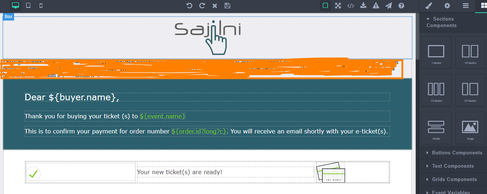

#### 2.7.4 Invitations

You can send invitation to emails, to buy specific tickets, with privacy invitation by email @TODO(add link to privacy invitation), where user can accept the invitation which will direct him, to buying process flow, for that specific invitation ticket type, and client shall continue buying it.

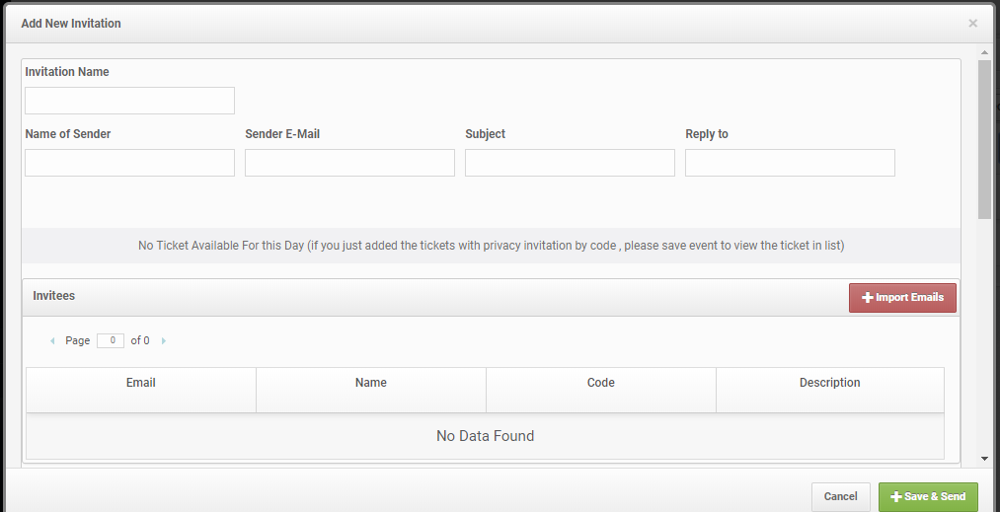

### 2.8 Manage Users

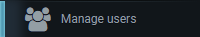

When you sign up you shall have Organizer Role, then you can create sub users for your user by **combining** groups of permissions:

* Cash Agents

* Scanning Agents

* And many more

  #### 2.8.1 Users Grid

  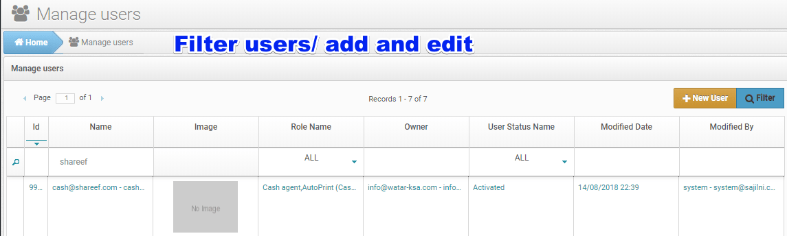

  #### 2.8.2 Add User Screen (Basic Details)

  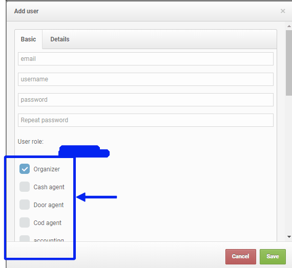

  #### 2.8.3 Add User Details (Detailed Details)

  You can add for user:

  * Website
  * FaceBook
  * Twitter
  * Youtube
  * Google Plus
  * Description
  * User Profile Image (End of the dialog below (Not visible))

  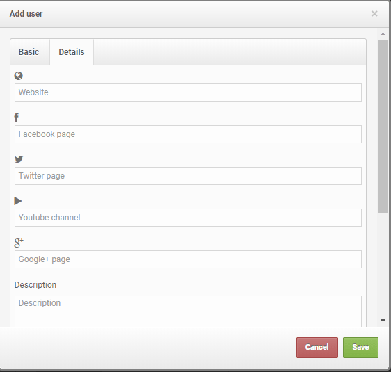

### 2.9 Tools

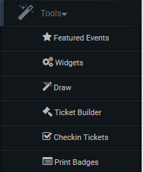

Here is set of custom tools to make life easier for Sajilni organizers.

#### 2.9.1 Draw

This feature is for lottery, it will pick dynamically, and randomly a winner for a ticket from, either checked in tickets, or paid tickets, with nice visual effects.

[Full Vedio Of Draw Process](./assets/draw-process.mp4)

#### 2.9.2 Ticket Builder

Create customize your tickets, either you wanted, 

* Any size of ticket predefined, or custom width and heigh
* Any Style, content ; text, shape, colour, skew, or resize anything
* Add your custom barcodes, QR, or code128, resize them 
* Drag And Drop any thing
* Resize Anything

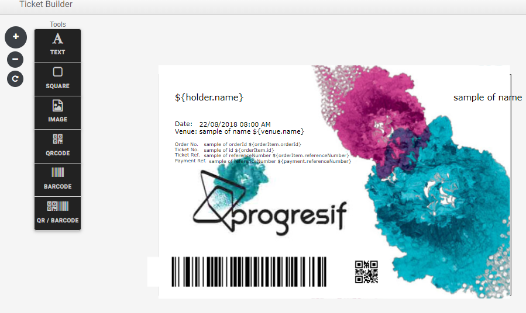

[Ticket Builder Short Vedio](./assets/ticket-builder-3.webm")

#### 2.9.3 Check-in Tickets

This feature is for scanning tickets from POS, point where you may have laptop and laser gun then you can connect it via USB, and while you are on this page, it will scan automatically, and print, you may also edit the form of some ticket, print it, or event create new Order.

**Features**

* Search for ticket
* Check In Ticket (auto by gun, or by choosing operation from screen)
* Check Out Ticket
* Monitor checked in, and out counts ( auto refresh or click on cycle icon)
* Check Access Location Detailed Report
* Choose Template Type For Printing
* Check if you wish auto print after success check in
* Check if you want to have selfie for client, to be printed on badge(this requires special configuration in ticket form to have selfie image question)
* Create New Orders
* Resend Tickets To Buyer Email

#### 2.9.4 Print Badges

Useful screen to print a lot of badges, for pre registrants.

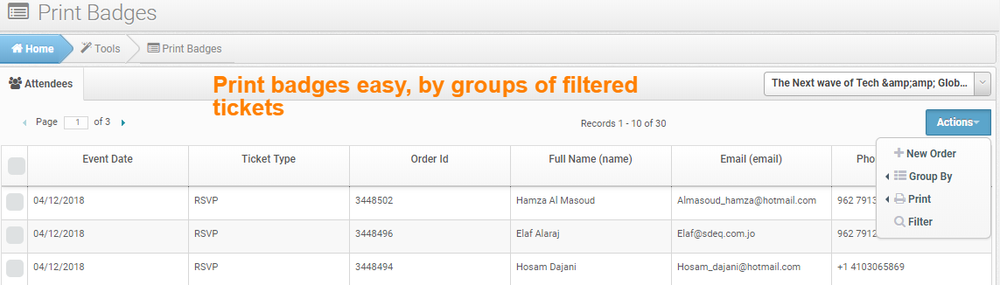

## Contact Us

Go to [Contact Us](https://www.sajilni.com/info/contact-us.html) page to keep on touch, and submit your contact information

------

##### For Further Information:

###### Sajilni LTD

*Amman, Jordan*

King Hussein Business, Park Building #23, A3-05

 +962-6-5805683

 +962-79-7169747

 [info@sajilni.com](mailto:info@sajilni.com)

------

###### Sajilni FZ LLC

*Dubai, United Arab Emirates*

Dubai Internet City, Building #1- Office 116

 +971-54-496-5685

 +971-55-237-7082

 [info@sajilni.com](mailto:info@sajilni.com)

[Contact Us](https://www.sajilni.com/info/contact-us.html)

### About Us

[You Can Read Our About Us Page here](https://www.sajilni.com/info/about-us.html)

### Our Clients

- [StepConverence](https://stepconference.com/)
- [EPOMEC](http://www.epomec.ae/)
- [WOP](https://www.wop-dubai.com/about/event-profile.html)
- [IPM](https://www.ipm-dubai.net/)
- [JFA](https://www.jfa.com.jo/en/)
- [HORECA-JORDAN](http://www.horeca-jordan.com/)
- [RedBull music sound clash](https://www.redbull.com/mea-en/events/red-bull-music-soundclash-jordan-2018)
- [Yanni Live at the Citadel](https://www.facebook.com/events/1640407439614264/)
- [أكاديمية الملكة رانية للمعلمين](http://www.qrta.edu.jo/)

### Reach To Our Email

Any Time You Can Contact [info@sajilni.com](info@sajilni.com)
