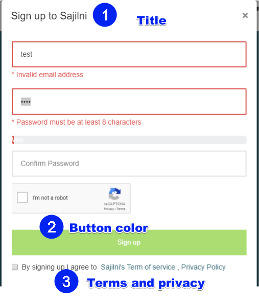

# **Customizing Sajilni Event Solution**

With **Sajilni** you can **style**, **customize**, and Brand **white label** your events.

##  1. **Styling your Single Sajilni Event**

You can style your <u>event</u>s to match you preferences.

**Sajilni** has power, in customizing not only behaviour but also, your event look and feel, of **Event page** and **Buy Process**. [e.g Style Event Page and Buy Process.](http://localhost:8080/#/stylingTheming?id=style-event-page)

* [Check How New Event Page Without Styling/Images Looks Like](./assets/event-before-any-customization.webm).
* [Check How New Buy Ticket Without Styling/Images Looks Like.](./assets/buyticket-normal.png)

##  2. **Styling all your Sajilni Events**

From your own logged in profile, you can set a default flavour for your colours, logos for your <u>event</u>s.

Same as [Styling your Single Sajilni Event](/stylingTheming?id=style-event-page),  and check [Where to do it](http://nimb.ws/l8Z2Gb) , this is more abstract, generic so you don't repeat same work for every event you own [Style All Your Events At Once](http://nimb.ws/1gPubB).

## 3. Customizing Sajilni Application

Now you can do Branding/White labeling with **Sajilni**, (This is only available for white  label plan, contact info@sajilni.com), your design, your rules.

###  4. Styling Application header, Footer

The **Header**, And **Footer** is one of the most important parts, in the system, because it appears on every page from **Home Page**, **Event Page**, and **Static Pages** too.

#### 4.1 Header theming

In addition to styling feature [Styling header, footer](/stylingTheming?id=styling-header-footer-colours-and-show-or-hide-other-parts), you can also, **White label Header** (This is only available for white  label plan, contact info@sajilni.com):

**Requirements**

1. Logo of size **182 X 97** (Recommended) with transparent background.

 [Example Sajilni Logo](https://www.sajilni.com./assets/resources/img/logo.png) 

2. Facebook, page of your preference.

3. Twitter, page of your preference.

4. Instagram, page of your preference.
5. Your preferred Font.
6. Main background colour, in case of **Sajilni** its white [white background header](www.sajilni.com)

#### 4.2 Header menu items

As you know [this is the header that is on home page and all system main screen.](/home?id=_1-1-header)

1. Show/Hide **Filter By Categories** menu.
2. **Sell with us** will be **hidden in all cases** of white labelling.
3. Show/Hide **Login**, and **Signup**. 

#### 4.3 Footer theming

In addition to styling feature [Footer](/home?id=_1-2-footer) where you can change in event page as example [read more here](/stylingTheming?id=_2-event-page-design), you can also, **White label Footer** (This is only available for white  label plan, contact info@sajilni.com):

**Requirements**

1. Footer Logo.
2. Your Company Name.
3. Help Agent you want to integrate(This shall affect most of your pages).
4. Colour of footer.

#### 4.4 Footer static pages

Labels for, footers contains the following pages:

1. About Us.
2. Contact Us.
3. FAQs.
4. Terms and services.
5. Privacy Policy.

And here is how **Sajilni** Footer looks like [read more about footer](/stylingTheming?id=_2-event-page-design) and its styling .

###  5. Styling the Signup page

You can now ask for white labelling, Sign Up Too ([read more about sign up here](/home?id=_1-sign-up)):

**Requirements**

1. Title of sign up.

2. Main button colour.

3. Terms and privacy.

4. Message to view for user after he submits, his request for sign up.

5. Email content, for sign up confirmation 

   * Here is how **Sajilni** [Default Confirmation email looks like](http://nimb.ws/GscRgL)

   * Here is how **Sajilni** default sign up looks like

#### 	5.1 Styling the [Event page](/home?id=_2-event-page)

And you can check here [Style Event Page](/stylingTheming?id=_2-event-page-design) , how you may style it, but for further theming and white labelling, you can also, **White label Event Page** (This is only available for white  label plan, contact info@sajilni.com),  [here is how it looks like before any styling]([Check How New Event Page Without Styling/Images Looks Like](./assets/event-before-any-customization.webm)).

**Requirements**

1. Header Styles (common component [read more](/stylingTheming?id=styling-header-footer-colours-and-show-or-hide-other-parts))
2. Footer Styles (common component [read more](/stylingTheming?id=styling-header-footer-colours-and-show-or-hide-other-parts))
3. Main Buying button colour(Ideal same as the one used for [Sign Up](/whitelabeling?id=_5-styling-the-signup-page) )
4. Size and Design for The Whole page including:
   1. Featured image part.
   2. Counter Count Down.
   3. Map to Inject.
   4. Where and how to view gallery, and even details.
   5. Font to use in this page ( Ideally this affect only the [sticky part](/home?id=_2-2-information-bar-sticky), because the details of the event can be formatted with special editor in add event).
5. Special Design/UI/UX ? , no problem just provide it to us.

#### 	5.2 Styling the Organizer Page

[This organizer page](/home?id=_3-organizer-page) that shows all your organizers event, have similar theme, with some differences, to white label it consider the following requirements:

**Requirements:**

1. Header Styles (common component [read more](/stylingTheming?id=styling-header-footer-colours-and-show-or-hide-other-parts))

2. Footer Styles (common component [read more](/stylingTheming?id=styling-header-footer-colours-and-show-or-hide-other-parts))

3. Main Buying button colour(Ideal same as the one used for [Sign Up](/whitelabeling?id=_5-styling-the-signup-page) )

4. Size and Design for The Whole page including:

   1. Featured image part (Organizer image, or may be venue).
   2. Facebook Page URL.
   3. Twitter Page URL.
   4. YouTube Channel URL.
   5. Website URL.
   6. Font to use in this page.

5. Special Design/UI/UX ? , no problem just provide it to us.

#### 	5.3 Styling the [Buy Ticket process](/home?id=_4-buy-ticket-process)

As mentioned here [Styling Buy Ticket Process](/stylingTheming?id=_2-style-buying-process), you can style the buy process to some great extend, to give your own unique flavour, experience to buying.

If you would like more, **White label** **Buy Ticket** (This is only available for white  label plan, contact info@sajilni.com),  [Check How New Buy Ticket Without Styling/Images Looks Like](./assets/buyticket-normal.png).

1. Logo, top left/ top right/ or even centred banner.

2. Colours for Even/Odd Rows in ticket list.

3. Size, colour and font for main texts in buying process.

4. Colour of Next Button.

5. Colour of Back Button.

6. Colour of Print Button.

7. Colour of Main Background.

8. Colour of Ticket Form Background.

9. Colour of Seating Plan Background.

10. Colour of Footer.

11. Colour of Header.

12. Colour of Spinner for increase/decrease Quantity of tickets.

13. Also hide some buttons, is optional like browse other events, and Try another payment.

####  	5.4 Custom [Payment](/home?id=_4-1-2-step-payment) Integration

At **Sajilni**, we have many payments methods, like PayPal, PayFort (@TODO add links to payement at sajilni), Still you can ask for your own payment gateway integration, for this regards, we shall need more technical details, about the API, Docs and we will implement it.

Another great thing is, you can provide us your bank account for these gateways to deposit directly into your accounts.

###  6. Email Communication

Communication is very important, Email is of course one of them, that's why we thought about it too.

If you would like more, **White label** **Emails** (This is only available for white  label plan, contact info@sajilni.com), [Check Contact Us](/home?id=contact-us).

#### 	6.1 [Signup](/home?id=_1-sign-up) Email

First step is first, at **Sajilni** you can sign up, and of course emails is there to help, you will get a confirmation email in your inbox, to confirm your sign up.

You can ask us for theming your sign up email, Here is how **Sajilni** [Default Confirmation email looks like](http://nimb.ws/GscRgL)

If you would like more, **White label** **Emails** (This is only available for white  label plan, contact info@sajilni.com),  [Check Contact Us](/home?id=contact-us).

**Requirements:**

1. Design of your choice(Logo, any picture, buttons).

2. Main/Mint Colours

3. Header

4. Footer

5. Content.

6. Email Subject.

7. Email From.

8. Email Name.

9. Email Reply To.

#### 	6.2 Order confirmation email (Pre-payment)

Now the fun part, Some one placed a post paid order, this has its own template as well, and you can check our default **Sajilni**, for Cash On Delivery, or Wire Transfer email template as example.

[Example of email Order Confirmation](http://nimb.ws/lJTxqc)

If you would like more, **White label** **Emails** (This is only available for white  label plan, contact info@sajilni.com),  [Check Contact Us](/home?id=contact-us).

**Requirements:**

1. Design of your choice(Logo, any picture, buttons).
2. Main/Mint Colours.
3. Header.
4. Footer.
5. Content.
6. Email Subject.
7. Email From.
8. Email Name.
9. Email Reply To.

#### 	6.3 Payment Confirmation email

Yes, you got it right, some one paid to buy some cool event tickets, he shall receive another email as invoice so lets see **Sajilni** default Payment Confirmation Email [like this email e.g](http://nimb.ws/GPlwWD).

If you would like more, **White label** **Emails** (This is only available for white  label plan, contact info@sajilni.com), [Check Contact Us](/home?id=contact-us)

**Requirements:**

1. Design of your choice(Logo, any picture, buttons).

2. Main/Mint Colours.

3. Header.

4. Footer.

5. Content.

6. Email Subject.

7. Email From.

8. Email Name.

9. Email Reply To.

#### 	6.4 Ticket Confirmation Email

When some one buys a ticket, he will get his tickets right ? well for this part we at **Sajilni**, have Email for ticket confirmation [Check example](http://nimb.ws/6D1la5), which will have attachments, for his tickets ( This is also customizable [Check this ticket e.g](http://nimb.ws/QcTvOx)).

If you would like more, **White label** **Emails** (This is only available for white  label plan, contact info@sajilni.com),  [Check Contact Us](/home?id=contact-us).

**Requirements:**

1. Design of your choice(Logo, any picture, buttons).

2. Main/Mint Colours.

3. Header.

4. Footer.

5. Content.

6. Email Subject.

7. Email From.

8. Email Name.

9. Email Reply To

#### 	6.5 Invitation Email

This kind of email is related to tickets that you want to sell by invitations sent via email, client will find a button to click and continue his buying, this special email template is the first email we talk about that has buttons to interact besides [Sign Up so far](/whitelabeling?id=_5-styling-the-signup-page).

If you would like more, **White label** **Emails** (This is only available for white  label plan, contact info@sajilni.com),  [Check Contact Us](/home?id=contact-us).

**Requirements:**

1. Design of your choice(Logo, any picture, buttons).

2. Main/Mint Colours

3. Header

4. Footer

5. Content.

6. Email Subject.

7. Email From.

8. Email Name.

9. Email Reply To

10. Buttons Colour for Yes, And No

#### 	6.6 By Request Email

At some situations when you want to filter your clients, and carefully pick them for some approvals, this is what you need, we have **3 Email Templates** for request;

1. Confirmation email for your ticket request.

2. Acceptance email when organizer decide to accept you buying request (after he review).

3. Rejection email when organizer decides he wont proceed with your request any more.

Behind this logic, there is what user gets in his email for that here is a quick look at some of them that is used in **Sajilni** [, here is how request confirmation looks like](http://nimb.ws/nRJfuW) , here is how [acceptance email looks like](http://nimb.ws/NsCExJ).

If you would like more, **White label** **Emails** (This is only available for white  label plan, contact info@sajilni.com),  [Check Contact Us](/home?id=contact-us).

**Requirements:**

1. Design of your choice(Logo, any picture, buttons).

2. Main/Mint Colours.

3. Header.

4. Footer.

5. Content.

6. Email Subject.

7. Email From.

8. Email Name.

9. Email Reply To

#### 	6.7 User Creation Email

Ok so you do wanna create your users under your control to sell, or follow-up may be just monitor etc..., you can do that at **Sajilni** , where you can manage users, create, edit or delete.

When you create user at **Sajilni** user shall get an email with his credentials, to continue login, that's it.

If you would like more, **White label** **Emails** (This is only available for white  label plan, contact info@sajilni.com),  [Check Contact Us](/home?id=contact-us).

**Requirements:**

1. Design of your choice(Logo, any picture, buttons).
2. Main/Mint Colours
3. Header
4. Footer
5. Content.
6. Email Subject.
7. Email From.
8. Email Name.
9. Email Reply To
10. Buttons color

#### 	6.8 Newsletter

On demand to keep your clients up to date and new, with you we offer this as email to be sent on defined schedule, to your loyal clients.

If you would like more, **White label** **Emails** (This is only available for white  label plan, contact info@sajilni.com), [Check Contact Us](/home?id=contact-us).

**Requirements:**

1. Design of your choice(Logo, any picture, buttons).
2. Main/Mint Colours.
3. Header.
4. Footer.
5. Content.
6. Email Subject.
7. Email From.
8. Email Name.
9. Email Reply To.

###  7. Default PDF Ticket Templates

This concept is easy, yet very powerful,  it gives you the ability to distinguish the Ticket templates, by:

1. Which event you want them to be used for.
2. Which language you want them to be used for.
3. Which ticket types you want them to be used for.
4. Finally if its POS or E-Tickets.

We at **Sajilni** have One main template used by default, for any new event gets created have a look [here](http://nimb.ws/sPH2cU) its built with **Sajilni** [ticket builder, to build it](acceptance email looks like)

If you would like more, **White label** **Default Ticket Templates**  is here to help, (This is only available for white  label plan, contact info@sajilni.com),  [Check Contact Us](/home?id=contact-us).

**Requirements:**

1. Main Image on the ticket, if there is no custom ticket background defined for that event.
2. Size of ticket in millimetre, or predefined as A4, A5 etc...
3. Place of barcode(s) in millimetre.
4. Size of barcodes(s) in millimetre.
5. Content of the ticket like, Order Id, Ticket No, Buyer name, Event name, Ticket Type, Date, time etc...
6. Any Shape as Design, Colour, Font Size, UI.
7. Any Fixed Content

#### 	7.1 POS Tickets

You have the ability to create, print as **POS** means you can have different templates for the tickets:

1. **Gets sold at the event (door,cash agents) [POS TICKETS]**
2. Get printed at the event as badges for example.

**Requirements:**

1. Main Image on the ticket, if there is no custom ticket background defined for that event.

2. Size of ticket in millimetre, or predefined as A4, A5 etc...

3. Place of barcode(s) in millimetre.

4. Size of barcodes(s) in millimetre.

5. Content of the ticket like, Order Id, Ticket No, Buyer name, Event name, Ticket Type, Date, time etc...

6. Any Shape as Design, Colour, Font Size, UI.

7. Any Fixed Content.

Have a look at some of the tickets we have :

* [Default **Sajilni** Ticket](http://nimb.ws/sPH2cU)

* Other Events Cool Tickets [, one of our previous events](http://nimb.ws/RjVwP5) , [another one too](http://nimb.ws/sp6u1X), [ Check POS print badges example ](http://nimb.ws/ebDJKw)

If you would like more, **White label POS Default tickets**  is here to help, (This is only available for white  label plan, contact info@sajilni.com),  [Check Contact Us](/home?id=contact-us).

#### 	7.2 E-Tickets

You also can create, print as **E-Ticket** means you can have different templates for the tickets,**Get bought from online client. [E- TICKETS]**

**Requirements:**

1. Main Image on the ticket, if there is no custom ticket background defined for that event.

2. Size of ticket in millimetre, or predefined as **A4**, A5 etc..

3. Place of barcode(s) in **millimetre**.

4. Size of barcodes(s) in **millimetre**.

5. Content of the ticket like, Order Id, Ticket No, Buyer name, Event name, Ticket Type, Date, time etc..

6. Any Shape as Design, Colour, Font Size, UI.

7. Any Fixed Content.

Have a look at some of the tickets we have :

- [Default **Sajilni** Ticket](http://nimb.ws/sPH2cU)

- Other Events Cool Tickets [, one of our previous events](http://nimb.ws/RjVwP5) , [another one too](http://nimb.ws/sp6u1X), [ Check POS print badges example ](http://nimb.ws/ebDJKw)

If you would like more, **White label E-tickets**  is here to help, (This is only available for white  label plan, contact info@sajilni.com), [Check Contact Us](/home?id=contact-us).

## 3. Custom Home page

As we mentioned before [Home Page](/home?id=_1-home-page) has 2 parts to begin with:

* [Header](/home?id=_1-1-header)
* [Footer](/home?id=_1-2-footer)

You can also have your own home page Design, or Style, If you would like more, **White label Home Page**  is here to help, (This is only available for white  label plan, contact info@sajilni.com),  [Check Contact Us](/home?id=contact-us).

**Requirements:**

1. Design desired ( Your colours, font, designer thoughts).
2. Functionality desired (How Search Should Work Best For You).
3. Look and Feel (How Event Result List To Appear).
4. Google Analytics code.
5. You own help integration/ or we can provide ( **Sajilni** uses [Zendesk](http://nimb.ws/FBAoch)).

## 4. Scanning Application branding

**Sajilni** has powerful, yet customizable [Android scanning app](http://nimb.ws/a8YelD), it works offline, and do checking, and checkout too, lots of permissions, and monitoring as well.

If you would like more, **White label Scanning APP branding**  is here to help, (This is only available for white  label plan, contact info@sajilni.com),  [Check Contact Us](/home?id=contact-us).

**Requirements:**

1. Your Logo, when the app loads up it shows, at login page.
2. Main Colour for the APP.
3. Mint Colour for the APP.

## 6. Dialogue Messages

**Sajilni** provides a lot of messages to right the UX, for clients, its localized and every where, you may customize, change content for any message in the system, for example, when someone requests a tickets by request, it says: 

*You have submitted your request successfully you shall receive and email confirmation of your request, and then when reviewed you shall receive acceptance or rejection.*

You can ask to change any message on the system.

**Requirements:**

1. What language you want that message for
2. Where is that message
3. What is the content of that message
4. Any Additional logic you want this message to appear (New Message)

If you would like more, **White label Dialog Messages**  is here to help, (This is only available for white  label plan, contact info@sajilni.com),  [Check Contact Us](/home?id=contact-us).

## Contact Us

Go to [Contact Us](https://www.sajilni.com/info/contact-us.html) page to keep on touch, and submit your contact information

------

##### For Further Information:

###### Sajilni LTD

*Amman, Jordan*

King Hussein Business, Park Building #23, A3-05

 +962-6-5805683

 +962-79-7169747

 [info@sajilni.com](mailto:info@sajilni.com)

------

###### Sajilni FZ LLC

*Dubai, United Arab Emirates*

Dubai Internet City, Building #1- Office 116

 +971-54-496-5685

 +971-55-237-7082

 [info@sajilni.com](mailto:info@sajilni.com)

[Contact Us](https://www.sajilni.com/info/contact-us.html)

### About Us

[You Can Read Our About Us Page here](https://www.sajilni.com/info/about-us.html)

### Our Clients

- [StepConverence](https://stepconference.com/)
- [EPOMEC](http://www.epomec.ae/)
- [WOP](https://www.wop-dubai.com/about/event-profile.html)
- [IPM](https://www.ipm-dubai.net/)
- [JFA](https://www.jfa.com.jo/en/)
- [HORECA-JORDAN](http://www.horeca-jordan.com/)
- [RedBull music sound clash](https://www.redbull.com/mea-en/events/red-bull-music-soundclash-jordan-2018)
- [Yanni Live at the Citadel](https://www.facebook.com/events/1640407439614264/)
- [أكاديمية الملكة رانية للمعلمين](http://www.qrta.edu.jo/)

### Reach To Our Email

Any Time You Can Contact [info@sajilni.com](info@sajilni.com)
